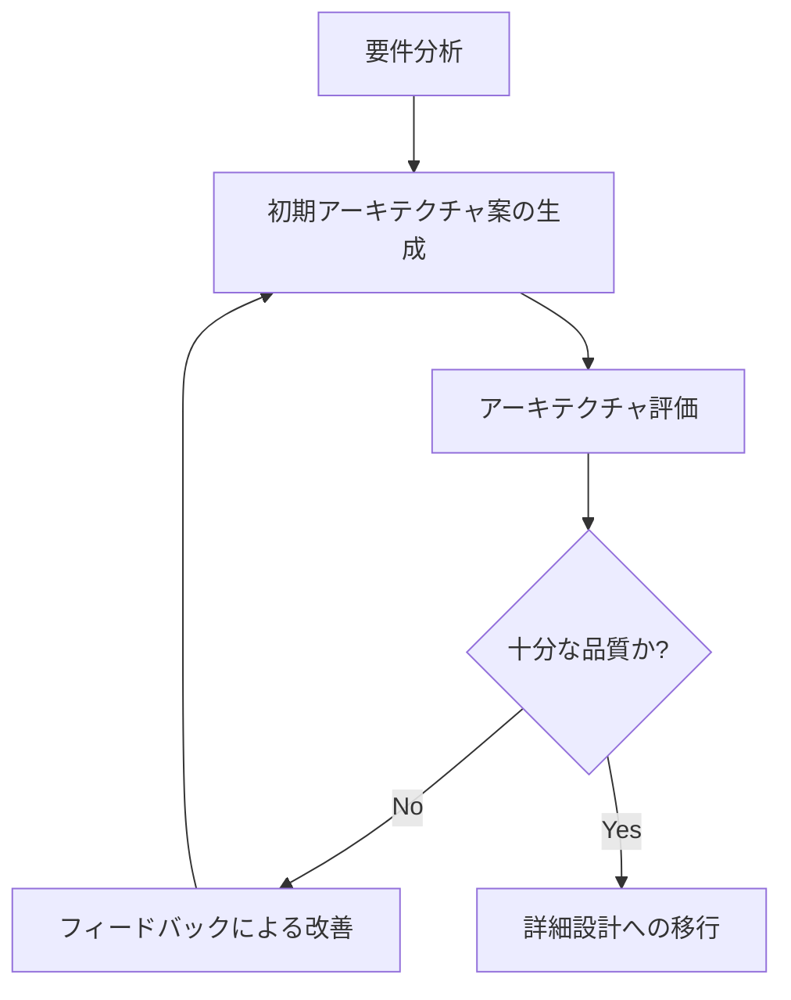
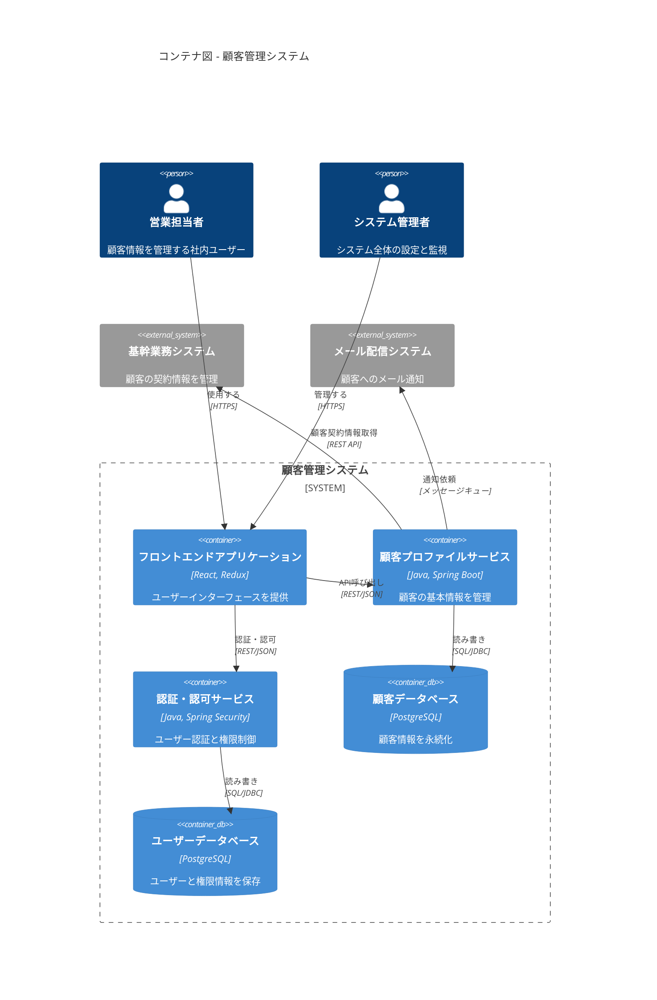

#### 2.3.1 アーキテクチャ設計書（アーキテクチャ設計図）

アーキテクチャ設計書は、システム全体の構造、主要コンポーネントの責任、それらの関係性、および技術選定の根拠を定義するドキュメントです。AI駆動アプローチでは、構造化されたJSON形式でアーキテクチャ情報を管理し、AIによる設計案生成や整合性検証の基盤とします。

##### 2.3.1.1 アーキテクチャ設計のJSON構造例

```json
{
  "$schema": "https://example.com/schemas/architecture-design-v1.json",
  "document_info": {
    "id": "ARCH-001",
    "title": "アーキテクチャ設計書",
    "project_name": "顧客管理システム刷新",
    "version": "1.0.0",
    "last_updated": "2025-03-10T14:30:00Z",
    "status": "approved",
    "authors": ["アーキテクトチーム", "AI Assistant"],
    "document_type": "architecture_design",
    "dependencies": [
      {
        "document_id": "INFRA-001",
        "relationship": "influences"
      },
      {
        "document_id": "SEC-001",
        "relationship": "influences"
      },
      {
        "document_id": "IF-001",
        "relationship": "influences"
      }
    ],
    "confidentiality": "internal_only"
  },
  "document_history": [
    {
      "version": "0.1.0",
      "date": "2025-03-05T10:00:00Z",
      "description": "初期アーキテクチャ案",
      "authors": ["アーキテクトチーム"]
    },
    {
      "version": "0.2.0",
      "date": "2025-03-08T15:00:00Z",
      "description": "AIフィードバック反映版",
      "authors": ["AI Assistant"]
    },
    {
      "version": "1.0.0",
      "date": "2025-03-10T14:30:00Z",
      "description": "正式版リリース",
      "authors": ["アーキテクトチーム", "AI Assistant"]
    }
  ],
  "architecture_overview": {
    "summary": "マイクロサービスアーキテクチャに基づく、AWSクラウド上でコンテナ化された顧客管理システム",
    "key_characteristics": [
      "疎結合なマイクロサービス構成",
      "イベント駆動型アーキテクチャ",
      "API優先設計",
      "Infrastructure as Code"
    ],
    "quality_attributes": {
      "scalability": {
        "description": "各サービスが個別にスケール可能",
        "strategy": "水平スケーリング",
        "target": "ピーク時500TPS"
      },
      "availability": {
        "description": "システム全体で高可用性を確保",
        "strategy": "冗長化、自動フェイルオーバー",
        "target": "99.95%アップタイム"
      },
      "security": {
        "description": "ゼロトラストセキュリティモデル",
        "strategy": "サービス間相互TLS、最小権限原則",
        "target": "OWASP Top 10対応"
      }
    }
  },
  "architecture_principles": [
    {
      "id": "PRIN-001",
      "name": "ドメイン駆動設計",
      "description": "ビジネスドメインを中心としたサービス分割",
      "rationale": "ビジネス変更に対する適応性向上",
      "implications": [
        "ドメインエキスパートとの緊密な協業が必要",
        "ユビキタス言語の定義と維持"
      ]
    },
    {
      "id": "PRIN-002",
      "name": "API優先設計",
      "description": "コンポーネント間のインターフェースを先に設計",
      "rationale": "並行開発とインテグレーションの容易化",
      "implications": [
        "API設計の時間投資が必要",
        "OpenAPI/Swagger仕様の活用"
      ]
    },
    {
      "id": "PRIN-003",
      "name": "イミュータブル インフラストラクチャ",
      "description": "環境変更は再デプロイで実現、現地変更不可",
      "rationale": "環境の一貫性と再現性を確保",
      "implications": [
        "CI/CDパイプラインの整備",
        "IaCツールの活用"
      ]
    }
  ],
  "system_context": {
    "description": "システムの境界と外部システムとの関係",
    "external_systems": [
      {
        "id": "EXT-001",
        "name": "基幹業務システム",
        "description": "顧客の契約情報を管理",
        "integration_method": "REST API",
        "data_flow": "双方向",
        "interaction_frequency": "リアルタイム"
      },
      {
        "id": "EXT-002",
        "name": "メール配信システム",
        "description": "顧客へのメール通知を担当",
        "integration_method": "メッセージキュー",
        "data_flow": "送信のみ",
        "interaction_frequency": "イベント駆動"
      }
    ],
    "user_types": [
      {
        "id": "USER-001",
        "name": "営業担当者",
        "description": "顧客情報を登録・更新",
        "access_channels": ["Webアプリケーション", "モバイルアプリ"]
      },
      {
        "id": "USER-002",
        "name": "管理者",
        "description": "システム設定と利用状況を管理",
        "access_channels": ["管理コンソール"]
      }
    ]
  },
  "components": [
    {
      "id": "COMP-001",
      "name": "顧客プロファイルサービス",
      "type": "マイクロサービス",
      "description": "顧客の基本情報を管理するコアサービス",
      "responsibilities": [
        "顧客データのCRUD操作",
        "顧客検索",
        "重複チェック"
      ],
      "data_owned": ["customers", "addresses", "contacts"],
      "apis_provided": [
        {
          "id": "API-001",
          "name": "顧客API",
          "protocol": "REST",
          "endpoints": [
            "GET /customers",
            "POST /customers",
            "GET /customers/{id}",
            "PUT /customers/{id}",
            "DELETE /customers/{id}"
          ]
        }
      ],
      "dependencies": [
        {
          "component_id": "COMP-002",
          "description": "認証・認可サービスによるAPIアクセス制御",
          "interaction_type": "同期/RPC",
          "criticality": "high"
        }
      ],
      "deployment": {
        "container": "Docker",
        "scaling": "Auto-scaling group",
        "instance_size": "t3.medium",
        "min_instances": 2,
        "max_instances": 10
      },
      "quality_characteristics": {
        "availability": "99.95%",
        "performance": "p95レスポンスタイム300ms以内"
      }
    },
    {
      "id": "COMP-002",
      "name": "認証・認可サービス",
      "type": "マイクロサービス",
      "description": "ユーザー認証と権限管理",
      "responsibilities": [
        "ユーザー認証",
        "トークン発行・検証",
        "権限管理"
      ],
      "data_owned": ["users", "roles", "permissions"],
      "apis_provided": [
        {
          "id": "API-002",
          "name": "認証API",
          "protocol": "REST",
          "endpoints": [
            "POST /auth/login",
            "POST /auth/refresh",
            "POST /auth/logout",
            "GET /auth/permissions"
          ]
        }
      ],
      "dependencies": [],
      "deployment": {
        "container": "Docker",
        "scaling": "Auto-scaling group",
        "instance_size": "t3.small",
        "min_instances": 2,
        "max_instances": 6
      },
      "quality_characteristics": {
        "availability": "99.99%",
        "performance": "p95レスポンスタイム200ms以内"
      }
    },
    {
      "id": "COMP-003",
      "name": "フロントエンドアプリケーション",
      "type": "シングルページアプリケーション",
      "description": "ユーザーインターフェースを提供するWebアプリケーション",
      "responsibilities": [
        "ユーザーインターフェース表示",
        "バックエンドAPI呼び出し",
        "データ表示・入力"
      ],
      "data_owned": [],
      "apis_provided": [],
      "dependencies": [
        {
          "component_id": "COMP-001",
          "description": "顧客データの取得・更新",
          "interaction_type": "同期/REST",
          "criticality": "high"
        },
        {
          "component_id": "COMP-002",
          "description": "ユーザー認証",
          "interaction_type": "同期/REST",
          "criticality": "high"
        }
      ],
      "deployment": {
        "hosting": "S3 + CloudFront",
        "build_system": "Webpack",
        "cache_strategy": "Service Worker"
      },
      "quality_characteristics": {
        "performance": "First Contentful Paint 1.5秒以内",
        "accessibility": "WCAG 2.1 AA準拠"
      }
    }
  ],
  "cross_cutting_concerns": [
    {
      "id": "CCC-001",
      "name": "ロギング",
      "description": "統一的なログ収集・分析基盤",
      "implementation": {
        "approach": "ELKスタック",
        "components": ["Elasticsearch", "Logstash", "Kibana"],
        "retention_policy": "30日間"
      }
    },
    {
      "id": "CCC-002",
      "name": "監視・アラート",
      "description": "システム状態の監視とインシデント通知",
      "implementation": {
        "approach": "Prometheus + Grafana",
        "alert_channels": ["PagerDuty", "Slack"],
        "key_metrics": ["サービス可用性", "レスポンスタイム", "エラーレート"]
      }
    },
    {
      "id": "CCC-003",
      "name": "CI/CD",
      "description": "継続的インテグレーション・デリバリーパイプライン",
      "implementation": {
        "approach": "GitHub Actions + ArgoCD",
        "environments": ["開発", "テスト", "ステージング", "本番"],
        "promotion_strategy": "Git-based promotion with approvals"
      }
    }
  ],
  "technology_stack": {
    "frontend": {
      "framework": "React",
      "state_management": "Redux Toolkit",
      "ui_library": "Material UI",
      "build_tools": ["Webpack", "Babel"],
      "testing": ["Jest", "React Testing Library"]
    },
    "backend": {
      "languages": ["Java", "TypeScript"],
      "frameworks": ["Spring Boot", "NestJS"],
      "api": ["REST", "GraphQL"],
      "communication": ["HTTP/2", "gRPC"],
      "testing": ["JUnit", "Jest"]
    },
    "data": {
      "primary_database": {
        "type": "PostgreSQL",
        "version": "14",
        "deployment": "Amazon RDS"
      },
      "caching": {
        "technology": "Redis",
        "deployment": "Amazon ElastiCache"
      },
      "message_broker": {
        "technology": "Apache Kafka",
        "deployment": "Amazon MSK"
      },
      "search": {
        "technology": "Elasticsearch",
        "deployment": "Amazon OpenSearch Service"
      }
    },
    "infrastructure": {
      "cloud_provider": "AWS",
      "compute": {
        "primary": "ECS on EC2",
        "batch": "AWS Batch"
      },
      "networking": {
        "vpc_design": "Multi-AZ",
        "load_balancing": "Application Load Balancer",
        "cdn": "CloudFront"
      },
      "storage": {
        "object_storage": "S3",
        "block_storage": "EBS"
      },
      "iac_tools": ["Terraform", "AWS CDK"]
    },
    "devops": {
      "ci_cd": ["GitHub Actions", "ArgoCD"],
      "monitoring": ["Prometheus", "Grafana"],
      "logging": ["ELK Stack"],
      "secrets_management": "AWS Secrets Manager"
    }
  },
  "deployment_views": {
    "infrastructure_topology": {
      "regions": ["ap-northeast-1"],
      "availability_zones": ["ap-northeast-1a", "ap-northeast-1c"],
      "network_topology": {
        "vpc_cidr": "10.0.0.0/16",
        "public_subnets": ["10.0.1.0/24", "10.0.2.0/24"],
        "private_subnets": ["10.0.3.0/24", "10.0.4.0/24"],
        "database_subnets": ["10.0.5.0/24", "10.0.6.0/24"]
      }
    },
    "container_orchestration": {
      "platform": "ECS",
      "service_discovery": "AWS Cloud Map",
      "load_balancing": "Application Load Balancer"
    },
    "database_topology": {
      "primary_db": {
        "type": "RDS PostgreSQL",
        "deployment": "Multi-AZ",
        "backup_strategy": "自動バックアップ + スナップショット"
      },
      "redis": {
        "deployment": "ElastiCache Cluster Mode",
        "replication": true
      }
    }
  },
  "architecture_decision_records": [
    {
      "id": "ADR-001",
      "title": "マイクロサービスアーキテクチャの採用",
      "status": "Accepted",
      "date": "2025-03-01",
      "context": "モノリシックな現行システムのスケーラビリティとメンテナンス性に課題がある",
      "decision": "新システムはマイクロサービスアーキテクチャを採用する",
      "consequences": {
        "positive": [
          "サービス個別のスケーリングが可能",
          "チーム別の並行開発効率向上"
        ],
        "negative": [
          "分散システム複雑性の増加",
          "運用・モニタリング負荷の増加"
        ]
      },
      "alternatives_considered": [
        {
          "option": "モノリスリファクタリング",
          "pros": ["移行リスク低減", "分散システム複雑性回避"],
          "cons": ["スケーラビリティ制限継続", "技術的負債の残存"]
        }
      ]
    },
    {
      "id": "ADR-002",
      "title": "認証方式としてのOAuth 2.0 + JWTの採用",
      "status": "Accepted",
      "date": "2025-03-03",
      "context": "マイクロサービス間および外部クライアントとの認証方式の標準化が必要",
      "decision": "OAuth 2.0フレームワークとJWTトークンを認証基盤として採用",
      "consequences": {
        "positive": [
          "業界標準プロトコルによる相互運用性",
          "ステートレスな認証によるスケーラビリティ向上"
        ],
        "negative": [
          "トークン漏洩リスクへの対策必要",
          "実装複雑性の増加"
        ]
      },
      "alternatives_considered": [
        {
          "option": "セッションベース認証",
          "pros": ["シンプルな実装", "トークン漏洩リスク低減"],
          "cons": ["ステートフル（セッションストア必要）", "マイクロサービス間連携の複雑化"]
        }
      ]
    }
  ],
  "traceability": {
    "requirements_to_components": [
      {
        "requirement_id": "FR-001",
        "requirement_title": "顧客情報登録機能",
        "components": ["COMP-001"]
      },
      {
        "requirement_id": "FR-002",
        "requirement_title": "顧客情報検索機能",
        "components": ["COMP-001", "COMP-003"]
      },
      {
        "requirement_id": "NFR-S-001",
        "requirement_title": "認証方式",
        "components": ["COMP-002"]
      }
    ]
  },
  "risks_and_mitigations": [
    {
      "id": "RISK-001",
      "title": "マイクロサービス間通信の遅延",
      "description": "複数サービスを跨ぐリクエストでのレイテンシ累積",
      "impact": "high",
      "probability": "medium",
      "mitigation_strategy": [
        "API Gateway pattern導入",
        "キャッシング戦略の検討",
        "非同期通信の活用"
      ]
    },
    {
      "id": "RISK-002",
      "title": "データ整合性の課題",
      "description": "分散データベースによる整合性確保の複雑さ",
      "impact": "high",
      "probability": "high",
      "mitigation_strategy": [
        "Saga パターンの導入",
        "結果整合性モデルの採用",
        "分散トレーシングによる問題検出"
      ]
    }
  ]
}
```

##### 2.3.1.2 AIによるアーキテクチャ分析と評価

アーキテクチャの設計・評価においてAIを活用することで、人間の経験や知識を補完し、より堅牢で適応性の高い設計を実現できます。特に以下のようなアーキテクチャ分析タスクがAIの得意領域です。

1. **アーキテクチャ品質特性評価**

プロンプト例:
```
以下のアーキテクチャ設計をISOの品質特性モデルに基づいて評価してください。
特に、スケーラビリティ、可用性、セキュリティ、保守性、相互運用性の観点で
強みと弱み、改善案を具体的に指摘してください。

{アーキテクチャ設計のJSON}
```

出力例:
```json
{
  "architecture_evaluation": {
    "overall_assessment": "設計全体としては堅牢で、特にスケーラビリティと可用性に強みを持つ。ただし、セキュリティと保守性において改善の余地がある。",
    "quality_attributes": {
      "scalability": {
        "rating": 4.5,
        "strengths": [
          "各マイクロサービスの独立したスケーリング戦略",
          "負荷に応じた自動スケーリング設定",
          "ステートレス設計による水平スケーリングのしやすさ"
        ],
        "weaknesses": [
          "データベース層のスケーリング戦略が不十分"
        ],
        "recommendations": [
          "RDSのリードレプリカ設定の追加",
          "書き込み集中ワークロード対策としてのシャーディング検討"
        ]
      },
      "availability": {
        "rating": 4.0,
        "strengths": [
          "マルチAZ配置による障害耐性",
          "サービス冗長化とロードバランシング",
          "自動復旧メカニズム"
        ],
        "weaknesses": [
          "単一リージョン構成によるリージョン障害への脆弱性",
          "API Gatewayの単一障害点リスク"
        ],
        "recommendations": [
          "重要サービスのマルチリージョン配置検討",
          "障害注入テストによる回復性検証"
        ]
      },
      "security": {
        "rating": 3.5,
        "strengths": [
          "JWTベースの認証基盤",
          "TLS通信の徹底",
          "最小権限原則の適用"
        ],
        "weaknesses": [
          "セキュリティ監視・検知体制の詳細が不足",
          "脅威モデリングの痕跡が見られない",
          "トークン漏洩対策の具体性不足"
        ],
        "recommendations": [
          "WAFの導入",
          "脅威モデリングワークショップの実施",
          "セキュリティ監視戦略の詳細化"
        ]
      },
      "maintainability": {
        "rating": 3.5,
        "strengths": [
          "マイクロサービスによる変更影響範囲の限定",
          "CI/CDパイプラインによる自動化",
          "IaCによる環境一貫性"
        ],
        "weaknesses": [
          "テスト戦略の詳細不足",
          "技術的負債管理の言及なし"
        ],
        "recommendations": [
          "テスト自動化戦略の詳細化",
          "技術的負債の定期的な評価・解消プロセスの確立",
          "コード品質メトリクスの導入"
        ]
      },
      "interoperability": {
        "rating": 4.0,
        "strengths": [
          "標準的なRESTベースAPI",
          "OpenAPI仕様の活用",
          "明確なサービス境界"
        ],
        "weaknesses": [
          "API互換性管理の詳細不足",
          "外部システム統合パターンの標準化不十分"
        ],
        "recommendations": [
          "API互換性テストの自動化",
          "サービス間契約テストの導入",
          "API変更管理プロセスの確立"
        ]
      }
    },
    "cross_cutting_recommendations": [
      "アーキテクチャ戦略の定期的なレビュー・改善サイクルの確立",
      "アーキテクチャ意思決定の背景と根拠の詳細なドキュメント化",
      "非機能要件テストの自動化と継続的な検証"
    ]
  }
}
```

2. **アーキテクチャパターンの推奨**

プロンプト例:
```
以下の要件とシステムコンテキストに基づいて、適切なアーキテクチャパターンを
推奨してください。各パターンの適用方法、メリット、デメリット、実装上の注意点も
含めてください。

要件の概要:
{要件の概要情報}

システムコンテキスト:
{システムコンテキスト情報}
```

出力例:
```json
{
  "recommended_patterns": [
    {
      "name": "Backends for Frontends (BFF)",
      "description": "フロントエンドアプリケーション専用のバックエンドAPIレイヤーを提供するパターン",
      "applicability": "Web・モバイルの両方のクライアントが存在し、それぞれに最適化されたAPIが必要",
      "benefits": [
        "クライアント特性に最適化されたAPI提供が可能",
        "フロントエンド開発チームの自律性向上",
        "バックエンドサービスの変更影響を吸収"
      ],
      "drawbacks": [
        "追加のサービス層による複雑性増加",
        "重複コードのリスク",
        "適切な責任分担が必要"
      ],
      "implementation_guidance": [
        "Web用BFFとモバイル用BFFを分離",
        "OpenAPI定義による明確なインターフェース設計",
        "キャッシング戦略の最適化",
        "マイクロフロントエンドとの組み合わせを検討"
      ]
    },
    {
      "name": "CQRS (Command Query Responsibility Segregation)",
      "description": "データの更新操作（コマンド）と参照操作（クエリ）を分離するパターン",
      "applicability": "読み取りと書き込みの負荷特性や最適化要件が異なる場合",
      "benefits": [
        "読み取り/書き込みの独立したスケーリング",
        "各操作に最適化されたデータモデルの採用",
        "複雑なドメインの分割統治"
      ],
      "drawbacks": [
        "実装複雑性の増加",
        "結果整合性モデルへの対応必要",
        "システム全体の理解難易度上昇"
      ],
      "implementation_guidance": [
        "段階的導入を検討（全システムではなく一部コンポーネントから）",
        "イベントソーシングとの組み合わせ検討",
        "読み取りモデルの非正規化戦略",
        "整合性の遅延許容度の明確化"
      ]
    }
  ],
  "overall_recommendation": "本システムでは、まずBFFパターンを導入して異なるクライアント要件に対応しつつ、顧客情報管理など読み取り負荷の高いコンポーネントにCQRSパターンを適用することを推奨します。ただし、CQRS導入によるシステム複雑性を考慮し、段階的なアプローチを取るべきです。"
}
```

3. **アーキテクチャ整合性検証**

プロンプト例:
```
以下のアーキテクチャ設計と非機能要件間の整合性を検証してください。
矛盾点や実現困難な要素、リスク要因を特定し、解決策を提案してください。

アーキテクチャ設計:
{アーキテクチャ設計のJSON}

非機能要件:
{非機能要件のJSON}
```

出力例:
```json
{
  "consistency_analysis": {
    "summary": "アーキテクチャと非機能要件の間に複数の整合性問題があり、特にパフォーマンスとセキュリティ要件に関して対応が必要です。",
    "issues": [
      {
        "id": "ISSUE-001",
        "category": "Performance",
        "severity": "High",
        "description": "顧客検索API応答時間要件（200ms以内）に対し、現在の設計（複数サービスを跨ぐ構成）では達成困難",
        "affected_elements": [
          "COMP-001", "COMP-003"
        ],
        "relevant_requirements": [
          "NFR-P-002"
        ],
        "recommendations": [
          "検索結果キャッシング導入",
          "検索サービス専用のリードレプリカ設定",
          "検索クエリの最適化とインデックス戦略の見直し"
        ]
      },
      {
        "id": "ISSUE-002",
        "category": "Security",
        "severity": "Medium",
        "description": "多要素認証要件（NFR-S-001）に対応する実装詳細がアーキテクチャに明示されていない",
        "affected_elements": [
          "COMP-002"
        ],
        "relevant_requirements": [
          "NFR-S-001"
        ],
        "recommendations": [
          "認証サービスに多要素認証コンポーネントを明示的に追加",
          "MFAプロバイダー（SMS、Email、TOTP等）の選定と統合方法の詳細化",
          "MFA検証フローのシーケンス図追加"
        ]
      }
    ],
    "overall_recommendations": [
      "非機能要件とアーキテクチャの整合性レビューを定期的に実施",
      "性能要件が厳しい機能に対するPoC（概念実証）の実施",
      "アーキテクチャを詳細化する際に、非機能要件のトレーサビリティマトリクスを維持"
    ]
  }
}
```

##### 2.3.1.3 AIを活用したアーキテクチャ設計の手法

1. **反復的アーキテクチャ設計プロセス**

AI駆動設計では、以下のような反復的プロセスでアーキテクチャを段階的に洗練させていきます：



2. **Cursorを使ったアーキテクチャ設計例**

```markdown
# Cursorチャットでの指示例

要件定義書と非機能要件定義書に基づいて、マイクロサービスアーキテクチャの初期設計を作成してください。
以下の情報を参照してください：

- 要件定義書: requirements/structured/functional_requirements.json
- 非機能要件: requirements/structured/non_functional_requirements.json

設計には以下の要素を含めてください：
1. 主要なマイクロサービスの特定とその責務
2. サービス間の依存関係と通信パターン
3. データ管理戦略（各サービスのデータ所有、共有データの扱い）
4. 技術スタック選定の根拠
5. デプロイメントトポロジー

出力は前述のアーキテクチャ設計JSONスキーマに従ってください。
```

3. **Windsurfによるシステムコンテキスト分析**

```markdown
# Windsurfでの指示例

以下の資料を分析し、システムコンテキスト図とコンテキスト境界を特定してください：

1. 要件定義書: requirements/structured/functional_requirements.json
2. 利害関係者リスト: requirements/structured/stakeholders.json
3. 現行システム接続図: references/current_system_connections.png

出力として以下を生成してください：
1. システムコンテキスト図（Mermaid形式）
2. 識別された外部システムとその相互作用のリスト
3. 主要なユーザーグループとその目標
```

4. **Clineを活用したアーキテクチャパターンの適用**

```bash
# Clineコマンド例

cline "requirements/structured/functional_requirements.json と 
requirements/structured/non_functional_requirements.json を分析し、
以下のアーキテクチャパターンの適用可能性と最適な実装方法を評価してください：

1. マイクロサービスアーキテクチャ
2. イベント駆動アーキテクチャ
3. CQRS（コマンドクエリ責任分離）
4. API Gateway パターン

評価結果はdesigns/architecture_patterns_evaluation.jsonとして保存してください。"
```

##### 2.3.1.4 アーキテクチャ設計ドキュメントの自動生成

構造化されたアーキテクチャ情報（JSON）から、人間が理解しやすい設計ドキュメントを自動生成できます。

1. **マークダウン形式の設計書生成**

プロンプト例:
```
以下のJSON形式のアーキテクチャ情報から、マークダウン形式の
アーキテクチャ設計書を生成してください。文書は以下のセクションを含み、
図表はMermaid記法で表現してください：

1. エグゼクティブサマリー
2. システムコンテキスト
3. 技術アーキテクチャ概要
4. コンポーネント詳細
5. 配置図
6. アーキテクチャ決定履歴
7. リスクと緩和策

アーキテクチャ情報:
{アーキテクチャ設計のJSON}
```

2. **アーキテクチャ図の自動生成**

JSONからC4モデルのコンテキスト図、コンテナ図、コンポーネント図などを自動生成できます。

```markdown
# Cursorチャットでの指示例

以下のJSONからC4モデルのコンテナ図をMermaid形式で生成してください。
システムの主要コンポーネント間の関係を明確に表現し、
外部システムとの境界も示してください。

{アーキテクチャ設計のJSON}
```

生成例（Mermaid形式）:


##### 2.3.1.5 トレーサビリティの確保

アーキテクチャ設計と要件のトレーサビリティを確保することで、変更の影響範囲把握や整合性検証が容易になります。

1. **要件-アーキテクチャマッピングの自動生成**

プロンプト例:
```
以下の要件定義ドキュメントとアーキテクチャ設計書を分析し、
要件（機能要件・非機能要件）とアーキテクチャコンポーネントの
マッピング表を生成してください。各要件がどのコンポーネントに
実装されるかを明確にし、ギャップや不明点も指摘してください。

要件定義:
{要件定義のJSON}

アーキテクチャ設計:
{アーキテクチャ設計のJSON}
```

2. **変更影響分析の自動化**

プロンプト例:
```
次の要件変更について、アーキテクチャへの影響を分析してください：

変更要件：「顧客プロファイルに契約履歴表示機能を追加する」

この変更が影響する可能性のあるすべてのアーキテクチャコンポーネント、
API、データモデル、UI要素を特定し、必要な修正を具体的に提案してください。
また、この変更に関連するリスクと緩和策も提示してください。

アーキテクチャ設計:
{アーキテクチャ設計のJSON}
```

##### 2.3.1.6 アーキテクチャレビューと継続的改善

AIを活用したアーキテクチャレビューと改善サイクルを確立することで、設計品質を継続的に向上させることができます。

1. **アーキテクチャレビューチェックリストの自動生成**

プロンプト例:
```
以下のアーキテクチャ設計に対するレビューチェックリストを作成してください。
品質特性（スケーラビリティ、可用性、保守性など）ごとに、
具体的な検証ポイントを15-20項目リストアップしてください。
各項目には重要度（高/中/低）も付けてください。

アーキテクチャ設計:
{アーキテクチャ設計のJSON}
```

2. **アーキテクチャの定期的な健全性診断**

継続的な設計改善のため、アーキテクチャの健全性を定期的に評価します。

```bash
# Clineを使った定期的なアーキテクチャ評価

cline "designs/structured/architecture_design.json を評価し、
現在のベストプラクティスやプロジェクトの進化した要件に照らして
改善すべき点を特定してください。特に技術的負債、スケーラビリティ、
セキュリティの観点で注目してください。
評価結果は designs/evaluations/architecture_health_check_$(date +%Y%m%d).md
として保存してください。"
```

##### 2.3.1.7 実践的なポイント

1. **アーキテクチャモデリングの段階的アプローチ**
   - 最初はシステムコンテキストとコンテナレベルの設計に集中
   - 詳細化は重要なコンポーネントから段階的に行う
   - AIに詳細化を依頼する際は適切な抽象度を指定する

2. **チームでのアーキテクチャレビュー効率化**
   - AIによる事前評価結果をレビュー会議の入力として活用
   - レビューポイントを構造化し、優先度付けして議論を効率化
   - 決定事項をADR（Architecture Decision Record）としてJSONで記録

3. **アーキテクチャと実装の整合性確保**
   - 定期的に実装コードとアーキテクチャモデルの差異をAIに分析させる
   - 実装から逆算したアーキテクチャモデルの自動生成と比較
   - アーキテクチャ準拠性のチェックを自動化（CI/CDパイプラインに組み込み）

アーキテクチャ設計は、システム全体の品質と進化の方向性を定める重要なフェーズです。AI駆動アプローチでは、構造化されたデータとAIの分析能力を組み合わせることで、より体系的で一貫性のある設計が可能になります。また、設計の評価・改善サイクルを高速化し、プロジェクトの成功確率を高めることができます。

AI駆動アーキテクチャ設計では、常に人間の専門知識とAIの能力を相補的に活用することが重要です。AIは代替案の提案、整合性チェック、影響分析などで強みを発揮しますが、最終的な設計判断はプロジェクトのコンテキストを深く理解した人間のアーキテクトが行うべきです。
