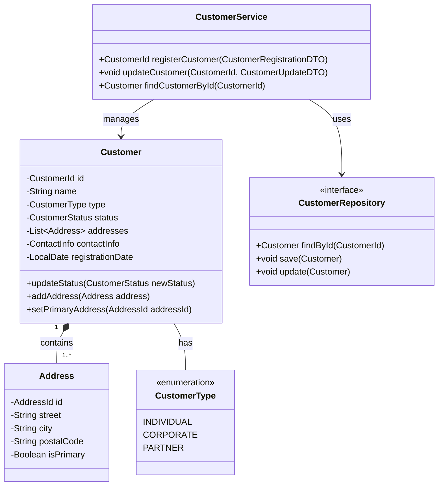

#### 2.3.4 クラス責任定義書（クラス図・責務定義書）

クラス責任定義書は、システムを構成するクラス（オブジェクト）とその責務、相互関係を定義するドキュメントです。AI駆動アプローチでは、クラス設計情報をJSON形式で構造化し、AIとの協働によって最適なオブジェクト指向設計を実現します。

##### クラス設計のJSON構造例

```json
{
  "document_info": {
    "id": "CLS-001",
    "title": "顧客管理システム - 基本クラス図",
    "project_name": "顧客管理システム刷新",
    "project_reference": "CRM-2025-001",
    "version": "1.0.0",
    "last_updated": "2025-03-10T14:30:00Z",
    "status": "approved",
    "authors": ["オブジェクト設計チーム"],
    "document_type": "class_responsibility_definition",
    "dependencies": [
      {
        "document_id": "ARCH-001",
        "relationship": "implements"
      },
      {
        "document_id": "DB-001",
        "relationship": "references"
      }
    ],
    "description": "顧客管理システムのコアドメインモデルを表現したクラス構造"
  },
  "document_history": [
    {
      "version": "0.5.0",
      "date": "2025-03-05T11:30:00Z",
      "description": "ドメインモデル初期設計",
      "authors": ["オブジェクト設計チーム"]
    },
    {
      "version": "1.0.0",
      "date": "2025-03-10T14:30:00Z",
      "description": "正式版リリース",
      "authors": ["オブジェクト設計チーム"]
    }
  ],
  "design_patterns": [
    {
      "pattern": "Repository",
      "application_points": ["顧客データアクセス", "活動履歴データアクセス"],
      "rationale": "データアクセス層の抽象化とテスト容易性の向上"
    },
    {
      "pattern": "Factory",
      "application_points": ["顧客オブジェクト生成"],
      "rationale": "複雑な顧客オブジェクト構築ロジックのカプセル化"
    }
  ],
  "packages": [
    {
      "id": "PKG-001",
      "name": "domain",
      "description": "ドメインモデルを表現するコアクラス群",
      "classes": ["Customer", "CustomerType", "Address", "ContactInfo", "SalesActivity"]
    },
    {
      "id": "PKG-002",
      "name": "application",
      "description": "アプリケーションサービスとユースケース実装",
      "classes": ["CustomerService", "SalesActivityService", "ReportingService"]
    },
    {
      "id": "PKG-003",
      "name": "infrastructure",
      "description": "外部システムとの連携やデータアクセス実装",
      "classes": ["CustomerRepository", "SalesActivityRepository", "ExternalSystemConnector"]
    }
  ],
  "classes": [
    {
      "id": "CLS-001",
      "name": "Customer",
      "stereotype": "entity",
      "package": "domain",
      "description": "顧客情報を表現するエンティティクラス",
      "responsibilities": [
        "顧客の基本情報（ID、名前、種別等）の保持",
        "顧客住所情報の管理",
        "連絡先情報の管理",
        "顧客ステータスの管理と状態遷移の制御"
      ],
      "attributes": [
        {
          "name": "id",
          "type": "CustomerId",
          "visibility": "private",
          "description": "顧客を一意に識別するID",
          "constraints": ["not null", "unique"]
        },
        {
          "name": "name",
          "type": "String",
          "visibility": "private",
          "description": "顧客名称",
          "constraints": ["not null", "max length: 100"]
        },
        {
          "name": "type",
          "type": "CustomerType",
          "visibility": "private",
          "description": "顧客種別（法人/個人）",
          "constraints": ["not null"]
        },
        {
          "name": "status",
          "type": "CustomerStatus",
          "visibility": "private",
          "description": "現在の顧客ステータス",
          "constraints": ["not null"]
        },
        {
          "name": "addresses",
          "type": "List<Address>",
          "visibility": "private",
          "description": "顧客の住所リスト",
          "constraints": []
        },
        {
          "name": "contactInfo",
          "type": "ContactInfo",
          "visibility": "private",
          "description": "主要連絡先情報",
          "constraints": []
        },
        {
          "name": "registrationDate",
          "type": "LocalDate",
          "visibility": "private",
          "description": "顧客登録日",
          "constraints": ["not null"]
        }
      ],
      "operations": [
        {
          "name": "updateStatus",
          "parameters": [
            {
              "name": "newStatus",
              "type": "CustomerStatus"
            }
          ],
          "return_type": "void",
          "visibility": "public",
          "description": "顧客ステータスを更新する。遷移不可能な状態への変更時は例外をスロー。",
          "business_rules": ["BR-101: 「解約済」状態からの状態変更は不可"]
        },
        {
          "name": "addAddress",
          "parameters": [
            {
              "name": "address",
              "type": "Address"
            }
          ],
          "return_type": "void",
          "visibility": "public",
          "description": "顧客の新しい住所を追加する"
        },
        {
          "name": "setPrimaryAddress",
          "parameters": [
            {
              "name": "addressId",
              "type": "AddressId"
            }
          ],
          "return_type": "void",
          "visibility": "public",
          "description": "指定IDの住所を主要住所に設定する",
          "exceptions": ["AddressNotFoundException"]
        }
      ],
      "invariants": [
        "顧客は少なくとも1つの住所を持つこと",
        "法人顧客の場合、会社名が必須であること"
      ],
      "dependencies": [
        {
          "class": "CustomerType",
          "type": "association",
          "description": "顧客は特定の顧客種別に属する"
        },
        {
          "class": "Address",
          "type": "composition",
          "description": "顧客は1つ以上の住所を持つ",
          "multiplicity": "1..*"
        },
        {
          "class": "ContactInfo",
          "type": "composition",
          "description": "顧客は連絡先情報を持つ",
          "multiplicity": "1"
        }
      ],
      "requirement_references": ["FR-001", "FR-002"],
      "design_notes": [
        "顧客IDは値オブジェクト（CustomerId）として実装し、型安全性を確保",
        "将来の拡張性を考慮し、状態遷移ロジックをStateパターンで実装する可能性あり"
      ]
    },
    {
      "id": "CLS-002",
      "name": "CustomerType",
      "stereotype": "enumeration",
      "package": "domain",
      "description": "顧客の種別を表す列挙型",
      "enum_values": [
        {
          "name": "INDIVIDUAL",
          "description": "個人顧客"
        },
        {
          "name": "CORPORATE",
          "description": "法人顧客"
        },
        {
          "name": "PARTNER",
          "description": "パートナー企業"
        }
      ],
      "requirement_references": ["FR-001"]
    },
    {
      "id": "CLS-010",
      "name": "CustomerService",
      "stereotype": "service",
      "package": "application",
      "description": "顧客管理に関するアプリケーションサービス",
      "responsibilities": [
        "顧客情報の登録・更新・検索機能の提供",
        "トランザクション境界の管理",
        "アクセス制御の実施",
        "ドメインオブジェクトとプレゼンテーション層の中継"
      ],
      "operations": [
        {
          "name": "registerCustomer",
          "parameters": [
            {
              "name": "customerData",
              "type": "CustomerRegistrationDTO"
            }
          ],
          "return_type": "CustomerId",
          "visibility": "public",
          "description": "新規顧客を登録し、生成された顧客IDを返す",
          "business_rules": ["BR-201: 同一メールアドレスでの重複登録チェック"],
          "security_constraints": ["登録権限（CUSTOMER_CREATE）が必要"]
        },
        {
          "name": "updateCustomer",
          "parameters": [
            {
              "name": "customerId",
              "type": "CustomerId"
            },
            {
              "name": "customerData",
              "type": "CustomerUpdateDTO"
            }
          ],
          "return_type": "void",
          "visibility": "public",
          "description": "既存顧客情報を更新する",
          "security_constraints": ["更新権限（CUSTOMER_UPDATE）または自身の情報の場合のみ許可"]
        }
      ],
      "dependencies": [
        {
          "class": "CustomerRepository",
          "type": "dependency",
          "description": "顧客データの永続化に利用"
        },
        {
          "class": "CustomerFactory",
          "type": "dependency",
          "description": "顧客オブジェクトの生成に利用"
        }
      ],
      "requirement_references": ["FR-001", "FR-003", "FR-004"],
      "transaction_behavior": "すべての公開メソッドでトランザクション境界を設定"
    }
  ],
  "relationships": [
    {
      "id": "REL-001",
      "source_class": "CustomerService",
      "target_class": "CustomerRepository",
      "type": "dependency",
      "stereotype": "uses",
      "description": "顧客サービスは顧客リポジトリを利用して永続化を行う"
    },
    {
      "id": "REL-002",
      "source_class": "Customer",
      "target_class": "Address",
      "type": "composition",
      "multiplicity_source": "1",
      "multiplicity_target": "1..*",
      "description": "顧客は1つ以上の住所を持つ（住所は顧客に属する）"
    }
  ],
  "design_constraints": [
    {
      "id": "DC-001",
      "description": "すべてのエンティティクラスはEquals/HashCodeを適切に実装すること",
      "rationale": "コレクション操作時の一貫性確保のため",
      "affected_elements": ["すべてのエンティティクラス"]
    },
    {
      "id": "DC-002",
      "description": "ドメイン層からインフラストラクチャ層への依存は禁止",
      "rationale": "レイヤー整合性とテスト容易性の確保",
      "affected_elements": ["domainパッケージ内のすべてのクラス"]
    }
  ],
  "metrics": {
    "total_classes": 15,
    "total_packages": 3,
    "average_methods_per_class": 5.2,
    "maximum_inheritance_depth": 2,
    "coupling_factor": "低（Low）"
  },
  "traceability": {
    "requirements_coverage": [
      {
        "requirement_id": "FR-001",
        "implementing_classes": ["Customer", "CustomerType", "CustomerService"]
      },
      {
        "requirement_id": "FR-002",
        "implementing_classes": ["Customer", "Address"]
      }
    ]
  }
}
```

##### AIを活用したクラス設計の実践方法

1. **ドメインモデルの初期設計生成**

AIにドメイン知識と要件を提供し、初期のクラスモデルを生成させることで、設計の出発点を効率的に作成できます。以下はその例です：

```
# ドメインモデル生成プロンプト例

次の要件定義から、顧客管理システムのドメインモデル（クラス図）の初期バージョンを設計してください。
ドメイン駆動設計のプラクティスに基づき、以下の要素を特定してJSON形式で出力してください：

1. エンティティ
2. 値オブジェクト
3. 集約ルート
4. リポジトリ
5. サービス
6. ファクトリ

各クラスには以下を含めてください：
- 責務（responsibilities）
- 主要な属性
- 主要な操作
- クラス間の関係

【要件定義】
{要件定義のJSON}

出力は前述のクラス図JSONスキーマに準拠させてください。
```

生成されたJSON形式のクラス設計は、AIとの対話を継続しながら詳細化・最適化を進めるための基盤となります。特にドメインエキスパートの知見を取り入れながら、実際のビジネスルールを反映したモデルへと洗練させていきます。

2. **責務の詳細化と最適化**

初期設計を基に、各クラスの責務を詳細化します。AIが提案する責務分担が適切かを評価し、必要に応じて調整します。

```
# 責務最適化プロンプト例

以下のクラス設計についてレビューし、Single Responsibility Principleの観点から責務の最適化を提案してください。
特に以下の点について検討してください：

1. CustomerServiceクラスの責務が多すぎないか
2. Customer集約内での責務分担は適切か
3. 不足している責務はないか

【クラス設計】
{クラスのJSON設計}

改善案をJSON形式で提案してください。クラスの分割・統合・責務の移動などの具体的な変更内容を含めてください。
```

3. **設計パターンの適用**

適切なデザインパターンを適用することで、クラス設計の品質を向上させることができます。AIにパターン適用の提案を依頼する例：

```
# デザインパターン適用プロンプト例

以下のクラス設計に適用可能なデザインパターンを分析し、改善案を提案してください。
特に以下の課題に対応するパターンを検討してください：

1. 顧客ステータスの状態遷移管理の複雑性
2. 異なる種類の顧客（個人/法人）の差異の扱い
3. 顧客データアクセスの抽象化

【クラス設計】
{クラスのJSON設計}

各パターン適用の具体的な実装方法とメリットをJSON形式で提案してください。
```

4. **設計検証と品質メトリクス分析**

設計の品質を客観的に評価するため、AIに各種メトリクスの計算と分析を依頼します：

```
# 設計品質分析プロンプト例

以下のクラス設計について、オブジェクト指向設計の品質メトリクスを計算し分析してください：

1. 結合度（Coupling）: クラス間の依存関係の強さ
2. 凝集度（Cohesion）: 各クラス内の責務のまとまり具合
3. 安定性（Stability）: 変更の影響を受けにくさ
4. パッケージ間の依存性循環の有無

【クラス設計】
{クラスのJSON設計}

各メトリクスのスコアと具体的な改善提案をJSON形式で出力してください。
特に問題点となる箇所（結合度が高すぎる箇所など）を具体的に指摘してください。
```

##### Mermaid記法を活用したクラス図可視化

JSON形式のクラス設計情報から、Mermaid記法を使って視覚的なクラス図を生成できます。AIに変換を依頼する例：

```
# JSON→クラス図（Mermaid）変換プロンプト例

以下のJSON形式のクラス設計から、Mermaid記法のクラス図を生成してください。
主要なクラス、関連、継承関係、重要な属性とメソッドを含めてください。
可読性を考慮し、適切にグループ化してください。

【クラス設計JSON】
{クラス設計のJSON}
```

生成例（部分）：



##### AIによるクラス設計改善案の生成

設計レビューや改善は、AIを活用することで効率化できます。クラス間の関係性や依存関係を分析し、リファクタリング案を提案してもらう例：

```
# クラス設計改善プロンプト例

以下のクラス設計について、リファクタリングの観点からレビューしてください。
特に以下の観点で分析してください：

1. 依存性の方向（依存性逆転の原則に沿っているか）
2. インターフェース分離の原則への適合度
3. 拡張しやすさ（オープン・クローズドの原則）

【クラス設計】
{クラスのJSON設計}

問題点と具体的な改善案をJSON形式で提案してください。
各改善提案には「現状の問題」「改善案」「期待される効果」を含めてください。
```

改善案出力例：
```json
{
  "design_review": {
    "summary": "全体として設計品質は良好ですが、いくつかの改善点が見つかりました。",
    "improvement_proposals": [
      {
        "id": "IMP-001",
        "target": "CustomerService",
        "current_issue": "CustomerServiceの責務が多すぎる。顧客登録、更新、検索に加えて通知処理なども含まれている。",
        "proposal": "CustomerServiceから通知関連の処理を分離し、新たにCustomerNotificationServiceクラスを作成する。",
        "expected_benefits": [
          "単一責任の原則に適合",
          "テスト容易性の向上",
          "機能拡張時の影響範囲の限定"
        ],
        "implementation_details": {
          "new_classes": [
            {
              "name": "CustomerNotificationService",
              "responsibilities": ["顧客への各種通知処理"],
              "operations": ["sendWelcomeMessage", "sendStatusUpdateNotification"]
            }
          ],
          "modified_classes": [
            {
              "name": "CustomerService",
              "removed_operations": ["sendCustomerNotifications"],
              "added_dependencies": ["CustomerNotificationService"]
            }
          ]
        }
      },
      {
        "id": "IMP-002",
        "target": "CustomerRepository",
        "current_issue": "CustomerRepositoryインターフェースに検索関連のメソッドが多数混在しており、単一の実装クラスが全機能を実装する必要がある。",
        "proposal": "検索機能をCustomerQueryRepositoryインターフェースとして分離し、Command-Query Responsibility Segregation(CQRS)パターンを適用する。",
        "expected_benefits": [
          "インターフェース分離の原則に適合",
          "実装の複雑性低減",
          "読み取り/書き込みの最適化戦略を個別に適用可能"
        ],
        "implementation_details": {
          "new_interfaces": [
            {
              "name": "CustomerCommandRepository",
              "operations": ["save", "update", "delete"]
            },
            {
              "name": "CustomerQueryRepository",
              "operations": ["findById", "findByName", "findByStatus", "findAll"]
            }
          ],
          "deprecated_interfaces": ["CustomerRepository"]
        }
      }
    ]
  }
}
```

##### ツール別クラス設計の実践例

1. **Cursorでのクラス設計と検証**

Cursorの対話型AIを活用したクラス設計ワークフローの例：

```markdown
# Cursorチャットでの指示例

要件定義ファイル（requirements/structured/functional_requirements.json）と
ドメインモデルの説明（docs/domain_model.md）を分析し、
クラス図の初期バージョンをJSON形式で生成してください。

生成後、以下の観点でレビューを行ってください：
1. 要件カバレッジ（すべての機能要件がクラスに割り当てられているか）
2. 責務の明確さと適切な分担
3. クラス間結合度の適切さ

最後に生成したJSONを `designs/structured/class_diagram.json` として保存し、
Mermaid記法のクラス図も生成して `designs/diagrams/class_diagram.md` に保存してください。
```

2. **Clineを活用したクラス設計の自動検証と最適化**

Clineを使った設計検証の自動化例：

```bash
# クラス設計品質の自動チェック
cline "designs/structured/class_diagram.json ファイルを読み込み、
オブジェクト指向設計の原則（SOLID）に照らして検証してください。
各原則に対する適合度を評価し、問題点と改善案を JSON 形式で
designs/reviews/class_design_review.json に出力してください。

特に以下の点を重点的にチェックしてください：
1. 単一責任の原則違反
2. 依存方向の適切さ
3. インターフェース設計の過不足
4. 継承関係の適切さ"
```

3. **Windsurfによるクラス設計とコード生成の連携**

設計からコードへのシームレスな移行を実現するWindsurfの活用例：

```
# Windsurfでのプロンプト例

designs/structured/class_diagram.json を読み込み、
以下の作業を実行してください：

1. Java言語でのクラス実装骨格を生成
2. 各クラスを適切なパッケージ構造で配置
3. Spring Frameworkのアノテーションを適用
4. JUnitテストクラスの骨格も生成

特に、Customerクラスとその関連クラスの実装に注力し、
インバリアント条件のバリデーションロジックも実装してください。

生成したコードは src/main/java と src/test/java ディレクトリに
適切なパッケージ構造で配置してください。
```

#### クラス設計の進化管理

AI駆動のクラス設計では、設計の進化を適切に管理することが重要です。JSONフォーマットは差分管理に適しており、設計変更の追跡が容易です。

1. **設計バージョン管理**
   
```json
{
  "version_history": [
    {
      "version": "0.1.0",
      "date": "2025-03-08",
      "author": "AI Design Assistant",
      "description": "初期ドメインモデル設計",
      "changes": []
    },
    {
      "version": "0.2.0",
      "date": "2025-03-10",
      "author": "System Architect",
      "description": "ドメインエキスパートレビュー後の修正",
      "changes": [
        {
          "type": "add_class",
          "class": "LoyaltyProgram",
          "reason": "顧客ロイヤリティ管理の責務を分離"
        },
        {
          "type": "modify_class",
          "class": "Customer",
          "modifications": [
            {
              "type": "add_attribute",
              "attribute": "loyaltyPoints",
              "reason": "ロイヤリティポイント追跡機能の追加"
            }
          ]
        }
      ]
    }
  ]
}
```

2. **トレーサビリティの維持**

要件からクラス設計、そしてコード実装までのトレーサビリティ確保も重要です：

```json
{
  "traceability_matrix": [
    {
      "requirement_id": "FR-005",
      "requirement_title": "顧客ステータス管理",
      "classes": [
        {
          "class_id": "CLS-001",
          "class_name": "Customer",
          "implementing_elements": ["status属性", "updateStatus操作"]
        },
        {
          "class_id": "CLS-011",
          "class_name": "CustomerStatusManager",
          "implementing_elements": ["validateStatusTransition操作"]
        }
      ],
      "verification_method": "顧客ステータス変更のユニットテスト"
    }
  ]
}
```

#### AI駆動クラス設計のベストプラクティス

1. **設計の段階的詳細化**
   - 最初はコアドメインに集中し、周辺部分は後から詳細化
   - 各反復で特定の側面（データモデル、振る舞い、例外処理など）に焦点

2. **複数の視点によるレビュー**
   - AIに異なる設計原則の観点からレビューを依頼
   - 様々なユースケースシナリオでの評価

3. **設計と実装の反復的検証**
   - プロトタイプ実装による設計の検証
   - テストケースを先に作成し、設計の妥当性を評価

4. **視覚化とドキュメント生成の自動化**
   - JSON設計からダイアグラム、コード、テストの自動生成
   - 説明ドキュメントの自動生成と維持

クラス責任定義書は、システムの構造と振る舞いを定義する重要な設計文書です。AI駆動アプローチを活用することで、より効率的かつ高品質なオブジェクト指向設計を実現できます。構造化されたJSONフォーマットとツールの活用により、設計情報の一貫性維持と進化管理が容易となり、実装フェーズへのスムーズな移行が可能となります。
