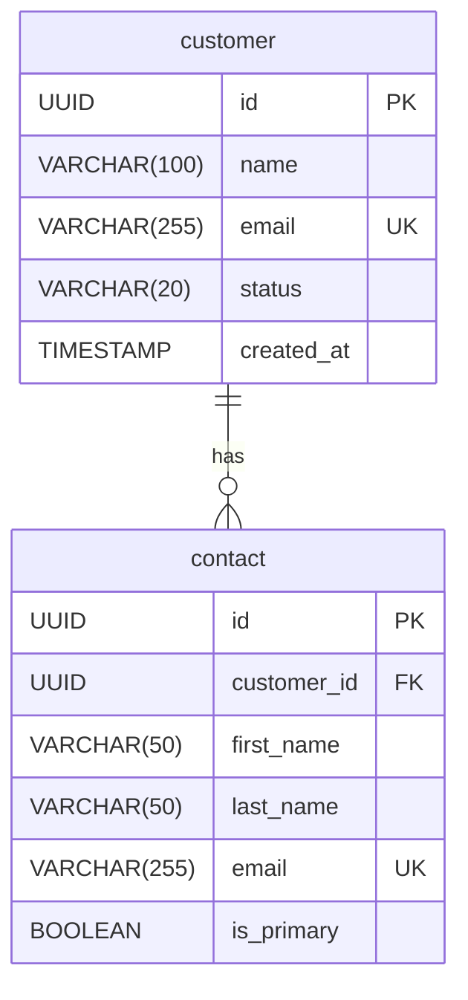

#### 3.3.3 データベース設計書（ER図・テーブル定義書）

データベース設計書は、システムのデータ構造、エンティティ間の関係、および各データ要素の詳細を定義するドキュメントです。AI駆動アプローチでは、データモデルをJSON形式で構造化し、一貫性のある設計を保ちながら自動検証や視覚化を効率的に行います。

##### 3.3.3.1 データベース設計書のJSON構造例

```json
{
  "document_info": {
    "id": "DB-001",
    "title": "顧客管理システム データベース設計",
    "project_name": "顧客管理システム刷新",
    "version": "1.2.0",
    "last_updated": "2025-03-10T15:30:00Z",
    "status": "approved",
    "authors": ["データベース設計チーム"],
    "document_type": "database_design",
    "dependencies": [
      {
        "document_id": "ARCH-001",
        "relationship": "implements"
      }
    ]
  },
  "database_settings": {
    "database_type": "PostgreSQL",
    "database_version": "15.2"
  },
  "document_history": [
    {
      "version": "1.0.0",
      "date": "2025-03-01T09:00:00Z",
      "description": "初版作成",
      "authors": ["データベース設計チーム"]
    },
    {
      "version": "1.1.0",
      "date": "2025-03-05T14:00:00Z",
      "description": "テーブル構造の最適化",
      "authors": ["データベース設計チーム"]
    },
    {
      "version": "1.2.0",
      "date": "2025-03-10T15:30:00Z",
      "description": "パフォーマンス改善のためのインデックス追加",
      "authors": ["データベース設計チーム"]
    }
  ],
  "design_principles": [
    {
      "id": "DP-001",
      "name": "正規化レベル",
      "description": "基本的に第3正規形を適用。パフォーマンス上必要な場合のみ非正規化を検討",
      "rationale": "データ整合性確保とアンチパターン回避"
    },
    {
      "id": "DP-002",
      "name": "命名規則",
      "description": "テーブル名は単数形、スネークケース。主キーはid、外部キーは{テーブル名}_id",
      "rationale": "一貫性のある命名による可読性向上"
    },
    {
      "id": "DP-003",
      "name": "インデックス戦略",
      "description": "頻繁に検索される列、外部キー、UNIQUE制約のある列にインデックスを適用",
      "rationale": "クエリパフォーマンス最適化"
    }
  ],
  "entities": [
    {
      "id": "ENT-001",
      "name": "customer",
      "description": "顧客基本情報",
      "physical_name": "customer",
      "attributes": [
        {
          "id": "ATTR-001",
          "name": "id",
          "physical_name": "id",
          "data_type": "UUID",
          "constraints": ["PRIMARY KEY"],
          "description": "顧客ID",
          "example": "a0eebc99-9c0b-4ef8-bb6d-6bb9bd380a11"
        },
        {
          "id": "ATTR-002",
          "name": "name",
          "physical_name": "name",
          "data_type": "VARCHAR(100)",
          "constraints": ["NOT NULL"],
          "description": "顧客名称",
          "example": "株式会社サンプル"
        },
        {
          "id": "ATTR-003",
          "name": "email",
          "physical_name": "email",
          "data_type": "VARCHAR(255)",
          "constraints": ["UNIQUE", "NOT NULL"],
          "description": "メールアドレス",
          "example": "contact@example.com"
        },
        {
          "id": "ATTR-004",
          "name": "status",
          "physical_name": "status",
          "data_type": "VARCHAR(20)",
          "constraints": ["NOT NULL"],
          "description": "顧客ステータス",
          "enum_values": ["active", "inactive", "prospect"],
          "default": "prospect",
          "example": "active"
        },
        {
          "id": "ATTR-005",
          "name": "created_at",
          "physical_name": "created_at",
          "data_type": "TIMESTAMP WITH TIME ZONE",
          "constraints": ["NOT NULL"],
          "description": "作成日時",
          "default": "CURRENT_TIMESTAMP",
          "example": "2025-03-10T10:00:00Z"
        }
      ],
      "indexes": [
        {
          "id": "IDX-001",
          "name": "idx_customer_email",
          "columns": ["email"],
          "type": "BTREE",
          "unique": true
        },
        {
          "id": "IDX-002",
          "name": "idx_customer_status",
          "columns": ["status"],
          "type": "BTREE",
          "unique": false
        }
      ]
    },
    {
      "id": "ENT-002",
      "name": "contact",
      "description": "顧客担当者情報",
      "physical_name": "contact",
      "attributes": [
        {
          "id": "ATTR-006",
          "name": "id",
          "physical_name": "id",
          "data_type": "UUID",
          "constraints": ["PRIMARY KEY"],
          "description": "担当者ID",
          "example": "b1fec99-9c0b-4ef8-bb6d-6bb9bd380a22"
        },
        {
          "id": "ATTR-007",
          "name": "customer_id",
          "physical_name": "customer_id",
          "data_type": "UUID",
          "constraints": ["NOT NULL", "FOREIGN KEY REFERENCES customer(id)"],
          "description": "顧客ID",
          "example": "a0eebc99-9c0b-4ef8-bb6d-6bb9bd380a11"
        },
        {
          "id": "ATTR-008",
          "name": "first_name",
          "physical_name": "first_name",
          "data_type": "VARCHAR(50)",
          "constraints": ["NOT NULL"],
          "description": "担当者名",
          "example": "太郎"
        },
        {
          "id": "ATTR-009",
          "name": "last_name",
          "physical_name": "last_name",
          "data_type": "VARCHAR(50)",
          "constraints": ["NOT NULL"],
          "description": "担当者姓",
          "example": "山田"
        },
        {
          "id": "ATTR-010",
          "name": "email",
          "physical_name": "email",
          "data_type": "VARCHAR(255)",
          "constraints": ["UNIQUE", "NOT NULL"],
          "description": "担当者メールアドレス",
          "example": "taro.yamada@example.com"
        },
        {
          "id": "ATTR-011",
          "name": "is_primary",
          "physical_name": "is_primary",
          "data_type": "BOOLEAN",
          "constraints": ["NOT NULL"],
          "description": "主要担当者フラグ",
          "default": "false",
          "example": "true"
        }
      ],
      "indexes": [
        {
          "id": "IDX-003",
          "name": "idx_contact_customer_id",
          "columns": ["customer_id"],
          "type": "BTREE",
          "unique": false
        },
        {
          "id": "IDX-004",
          "name": "idx_contact_email",
          "columns": ["email"],
          "type": "BTREE",
          "unique": true
        }
      ]
    }
  ],
  "relationships": [
    {
      "id": "REL-001",
      "name": "customer_contacts",
      "description": "顧客と担当者の関係",
      "parent_entity": "customer",
      "child_entity": "contact",
      "cardinality": "one-to-many",
      "parent_required": true,
      "child_required": false,
      "relationship_attributes": {
        "delete_rule": "CASCADE",
        "update_rule": "CASCADE"
      }
    }
  ],
  "physical_implementation": {
    "storage_settings": {
      "tablespace": "crm_data",
      "storage_engine": "INNODB",
      "character_set": "UTF8MB4",
      "collation": "utf8mb4_unicode_ci"
    },
    "partitioning": {
      "activity_log": {
        "partition_type": "RANGE",
        "partition_key": "created_at",
        "interval": "MONTH",
        "retention_period": "24 MONTHS"
      }
    },
    "performance_optimization": [
      {
        "target": "customer",
        "strategy": "キャッシュの活用",
        "description": "頻繁にアクセスされる顧客情報をリードレプリカとRedisで多階層キャッシュ"
      }
    ]
  },
  "data_migration": {
    "source_systems": [
      {
        "name": "legacy_crm",
        "tables": ["CUSTOMER_MASTER", "CONTACT_INFO"],
        "mapping_strategy": "詳細はデータ移行計画書DM-001参照"
      }
    ]
  },
  "data_validation_rules": [
    {
      "id": "DVR-001",
      "target_entity": "customer",
      "target_attribute": "email",
      "rule": "REGEXP_LIKE(email, '^[A-Za-z0-9._%+-]+@[A-Za-z0-9.-]+\\.[A-Za-z]{2,}$')",
      "error_message": "有効なメールアドレス形式ではありません"
    },
    {
      "id": "DVR-002",
      "target_entity": "contact",
      "rule": "SELECT COUNT(*) = 1 FROM contact WHERE customer_id = :customer_id AND is_primary = true",
      "error_message": "各顧客に対して、主要担当者は必ず1人設定されている必要があります"
    }
  ]
}
```

##### 3.3.3.2 ER図の自動生成とデータモデル視覚化

JSON形式で構造化されたデータベース設計情報から、ER図や物理データモデル図を自動生成できます。以下に典型的な視覚化手法を示します。

###### Mermaid形式のER図生成例

AIに以下のようなプロンプトを使用して、設計情報からMermaid形式のER図を生成できます：

```
# AIプロンプト例

以下のデータベース設計JSONからMermaid ERDダイアグラムを生成してください。
エンティティごとに主要な属性を含め、関係性を明確に示してください。
複雑すぎるモデルの場合は、主要エンティティのみに絞って図を簡略化してください。

【データベース設計JSON】
{データベース設計のJSON}
```

生成されるMermaid ER図の例：



このアプローチの利点：
- データモデルを視覚的に把握しやすい
- コード（JSON）とダイアグラムの一貫性が保証される
- 設計変更時に自動的に図も更新可能

##### 3.3.3.3 AIによるデータベース設計の生成と最適化

AIは要件からデータベース設計の初期案生成や既存設計の最適化に活用できます。以下にその実践例を示します。

###### 要件からのデータモデル生成

```
# Cursor/Clineでの指示例

以下のシステム要件から最適なデータベースモデルを設計してください。
エンティティ、属性、関係性を特定し、正規化された形でJSONモデルとして出力してください。
命名規則はスネークケース、一般的なデータベース設計のベストプラクティスに従ってください。

【システム要件】
このシステムは企業向け営業活動管理システムです。
- 顧客企業の情報を管理する
- 各顧客企業に複数の担当者が存在する
- 営業担当者は複数の顧客を担当できる
- 商談情報（金額、確度、予定成約日など）を記録する
- 営業活動の履歴（訪問、電話、メールなど）を記録する
- 各商談にはステータス（検討中、提案中、契約済みなど）がある
- 商品・サービスのカタログを管理する
- 商談には複数の商品・サービスが紐づく可能性がある
```

###### データベース設計の正規化と最適化

```
# Windsurfでの指示例

以下のデータベース設計をレビューし、次の観点で最適化してください：

1. 正規化：現在のスキーマで正規化が不十分または過剰な箇所を特定し修正
2. インデックス戦略：クエリパフォーマンスを考慮した適切なインデックス提案
3. データ型最適化：各フィールドに最適なデータ型の提案
4. パフォーマンス考慮点：大量データ処理時のボトルネック回避策

最適化後のスキーマを前述のJSON形式で出力し、変更点とその根拠も説明してください。

【データベース設計JSON】
{データベース設計のJSON}
```

##### 3.3.3.4 AI駆動によるデータベース設計の検証と評価

構造化されたデータベース設計は、AIによる自動検証や評価が可能です。

###### 設計の自動検証

以下は、データベース設計の整合性やベストプラクティス準拠を検証するAIプロンプト例です：

```
# データベース設計検証プロンプト

以下のデータベース設計JSONを分析し、以下の観点で問題点があれば指摘してください：

1. 参照整合性：外部キー関係の整合性確認
2. 命名規則の一貫性：テーブル名・カラム名の命名パターンチェック
3. インデックス戦略：不足しているインデックスや過剰なインデックスの検出
4. 正規化レベル：適切な正規化が行われているか
5. パフォーマンス影響：パフォーマンス上の懸念点
6. セキュリティ考慮点：機密データの扱いに関する問題
7. スケーラビリティ：大規模データ処理を想定した設計になっているか

問題点ごとに重要度（高/中/低）を付け、具体的な修正案も提示してください。

【データベース設計JSON】
{データベース設計のJSON}
```

###### 設計品質の評価指標

データベース設計の品質を評価する主な指標：

| 評価指標 | 説明 | AIによる検証方法 |
|---------|------|----------------|
| 正規化度 | 適切な正規形式に準拠しているか | データ冗長性と依存関係の分析 |
| 命名一貫性 | 命名規則の統一度 | パターン一致率の計算 |
| インデックス最適性 | クエリパターンに対するインデックス構成の適切さ | 想定クエリとインデックスのマッピング分析 |
| 参照整合性 | 外部キー制約の完全性 | 関係グラフの検証 |
| スケーラビリティ | 大規模データ処理における性能特性 | 設計パターンのスケーラビリティ評価 |
| セキュリティレベル | 機密データの保護対策 | 暗号化・アクセス制御の分析 |

##### 3.3.3.5 データ整合性ルールとビジネスロジックの定義

データベース設計には、データの整合性を保つためのルールやビジネスロジックも含める必要があります。

###### JSON Logic によるデータ整合性ルールの定義

```json
{
  "data_integrity_rules": [
    {
      "rule_id": "IR-001",
      "name": "顧客担当者存在ルール",
      "description": "顧客には少なくとも1人の主担当者が必要",
      "entities": ["customer", "contact"],
      "logic": {
        "some": [
          { "var": "customer.contacts" },
          { "==": [ { "var": "is_primary" }, true ] }
        ]
      },
      "validation_timing": "after_insert_update",
      "error_message": "顧客には少なくとも1人の主担当者が必要です"
    },
    {
      "rule_id": "IR-002",
      "name": "メールアドレス形式検証",
      "description": "メールアドレスは正しい形式である必要がある",
      "entities": ["customer", "contact"],
      "logic": {
        "matches": [
          { "var": "email" },
          "^[A-Za-z0-9._%+-]+@[A-Za-z0-9.-]+\\.[A-Za-z]{2,}$"
        ]
      },
      "validation_timing": "before_insert_update",
      "error_message": "有効なメールアドレス形式ではありません"
    }
  ]
}
```

AIにこれらのルールを評価させ、データモデルに適用する整合性検証を自動化できます。

```
# AIによる整合性ルール評価プロンプト

以下のデータベース設計とデータ整合性ルールを分析し、
以下の観点でルールの網羅性と実装可能性を評価してください：

1. ルールのカバレッジ：重要なビジネスルールが漏れなく定義されているか
2. 実装容易性：定義されたルールをどのレイヤー（DB制約、アプリケーションコード等）で実装すべきか
3. パフォーマンス影響：ルール検証によるパフォーマンスへの影響とその軽減策
4. 不足しているルール：追加すべきと思われる整合性ルールの提案

【データベース設計JSON】
{データベース設計のJSON}

【データ整合性ルールJSON】
{データ整合性ルールのJSON}
```

##### 3.3.3.6 データベース設計の進化と変更管理

データベース設計は静的なものではなく、要件変更や拡張に応じて進化します。AI駆動アプローチでは、この変更管理を効率化できます。

###### 設計変更の影響分析

新たな要件に対して、AIにデータベース設計への影響を分析させることができます：

```
# 設計変更影響分析プロンプト

以下のデータベース設計に対して、新たな要件を実装する場合の影響を分析してください。
既存のテーブル・カラムへの変更点、新規追加が必要なテーブル・カラム、
データ移行の必要性、アプリケーションへの影響度を詳細に評価してください。

【現在のデータベース設計】
{データベース設計のJSON}

【新たな要件】
1. 顧客企業のグループ管理機能を追加する（企業グループ-子会社関係）
2. 顧客担当者の役職・部署情報を管理できるようにする
3. 顧客との契約情報（契約開始日・終了日、契約種別、金額など）を管理する
4. システムの多言語対応のため、顧客・担当者の名称を複数言語で保持できるようにする
```

###### マイグレーションスクリプトの自動生成

設計変更が決定した後、AIにマイグレーションスクリプトを生成させることができます：

```
# マイグレーションスクリプト生成プロンプト

以下の変更要件に基づいて、既存のデータベース設計から新しい設計への
マイグレーションスクリプト（SQL）を生成してください。
データ整合性を保ちながら、可能な限りダウンタイムが最小限になるような
マイグレーション戦略も提案してください。

【現在のデータベース設計】
{データベース設計のJSON}

【変更後のデータベース設計】
{更新されたデータベース設計のJSON}

【対象データベース】
PostgreSQL 15.2
```

##### 3.3.3.7 データベース設計と要件・実装のトレーサビリティ

AI駆動開発における重要な側面は、要件からデータベース設計、さらに実装までのトレーサビリティです。

###### トレーサビリティマトリクスの例

```json
{
  "traceability_matrix": {
    "title": "要件-データモデル-実装トレーサビリティ",
    "version": "1.0.0",
    "last_updated": "2025-03-15T14:00:00Z",
    "mappings": [
      {
        "requirement_id": "FR-101",
        "requirement_title": "顧客企業情報管理",
        "entities": ["customer"],
        "implementation_components": [
          {"component_id": "COMP-201", "component_name": "CustomerRepository"},
          {"component_id": "COMP-202", "component_name": "CustomerService"}
        ],
        "test_cases": ["TC-301", "TC-302", "TC-303"]
      },
      {
        "requirement_id": "FR-102",
        "requirement_title": "顧客担当者管理",
        "entities": ["contact"],
        "implementation_components": [
          {"component_id": "COMP-203", "component_name": "ContactRepository"},
          {"component_id": "COMP-204", "component_name": "ContactService"}
        ],
        "test_cases": ["TC-304", "TC-305"]
      }
    ]
  }
}
```

このマトリクスにより、要件からデータベース設計、実装、テストまでの関連性を追跡できます。AIを活用して、このトレーサビリティを維持・検証することが可能です。

```
# トレーサビリティ検証プロンプト

以下の要件定義、データベース設計、実装コンポーネント情報を分析し、
トレーサビリティの欠落や不整合がないか検証してください。
特に以下の点に注目してください：

1. 未対応の要件：データモデルやコンポーネントへのマッピングがない要件
2. 未使用のエンティティ：要件に紐づいていないデータベースエンティティ
3. 要件とモデルの不一致：要件の内容とデータモデルの構造の矛盾
4. 実装不足：データモデルに対応する実装コンポーネントの欠落

【要件定義JSON】
{要件定義のJSON}

【データベース設計JSON】
{データベース設計のJSON}

【実装コンポーネント情報JSON】
{実装コンポーネント情報のJSON}
```

##### 3.3.3.8 ツール活用ガイドとベストプラクティス

###### Cursor を活用したデータベース設計の例

Cursor では以下のようなプロンプトパターンを活用することで、効率的にデータベース設計を進められます：

```markdown
# Cursorチャットでの指示例

以下の要件から、「顧客管理システム」のデータベース設計を生成してください。
エンティティ、属性、関係性を特定し、JSON形式で構造化してください。
各エンティティにはインデックス戦略も含めてください。

【要件】
- 顧客企業の基本情報（企業名、住所、業種など）を管理する
- 各顧客企業には複数の担当者が存在する
- 担当者情報として氏名、役職、連絡先を管理する
- 各顧客に対して複数の案件（商談）を管理する
- 案件には状態（検討中、提案中、成約など）と金額情報がある
- 営業担当者（自社）は複数の顧客企業を担当できる

生成されたJSONをdocs/designs/database/customer_management_schema.jsonに保存してください。
また、このスキーマをMermaid ERDとして視覚化し、docs/designs/database/customer_management_erd.mdに保存してください。
```

###### Cline を活用したデータベース検証の例

```bash
# Clineでのコマンド例

# データベース設計の一貫性検証
cline "docs/designs/database/customer_management_schema.json を分析し、
命名規則の一貫性、参照整合性、正規化レベルを評価してください。
問題点がある場合は具体的な修正案を提示し、修正したJSONを
docs/designs/database/customer_management_schema_optimized.json として保存してください。"

# 性能面での検証とインデックス最適化
cline "docs/designs/database/customer_management_schema_optimized.json を分析し、
パフォーマンスの観点で問題があるテーブル設計や不足しているインデックスを特定してください。
特に、以下のクエリパターンを効率的に処理できるようにインデックス戦略を最適化してください：
1. 顧客名での検索
2. 担当者メールアドレスでの検索
3. 商談金額範囲での絞り込み
4. 特定期間に成約した案件の集計

最適化後のスキーマをdocs/designs/database/customer_management_schema_performance.jsonとして保存してください。"
```

###### Windsurf を活用したデータベース設計と実装の連携

```
# Windsurfでのプロンプト例

以下のデータベース設計JSONからJPAエンティティクラス（Java）を生成し、
src/main/java/com/example/model ディレクトリ内に保存してください。
以下の点に注意してください：

1. Hibernateアノテーションを使用する
2. 各エンティティのリレーションシップを適切なアノテーションで表現する
3. インデックスやユニーク制約も反映させる
4. データバリデーション用のBean Validationアノテーションを追加する
5. Lombokの@Dataアノテーションでボイラープレートコードをシンプルにする

【データベース設計JSON】
docs/designs/database/customer_management_schema_performance.json
```

##### 3.3.3.9 チェックリストとレビューポイント

データベース設計の品質を確保するためのチェックリスト：

1. **基本設計チェック**
   - [ ] すべてのエンティティに適切な主キーが定義されているか
   - [ ] 外部キー関係が正しく定義されているか
   - [ ] 適切な正規化レベルが適用されているか
   - [ ] 命名規則が一貫して適用されているか

2. **パフォーマンスチェック**
   - [ ] 頻繁に実行されるクエリに適したインデックスが定義されているか
   - [ ] 大量データ処理を想定した設計になっているか
   - [ ] パーティショニング戦略は適切か
   - [ ] 不要なインデックスはないか

3. **整合性チェック**
   - [ ] すべての制約（NOT NULL、UNIQUE等）が適切に定義されているか
   - [ ] ビジネスルールがデータベース制約として表現されているか
   - [ ] データ型の選択は適切か
   - [ ] デフォルト値の設定は適切か

4. **セキュリティチェック**
   - [ ] 機密データの暗号化戦略は定義されているか
   - [ ] アクセス制御方針は明確か
   - [ ] 監査証跡（Audit Trail）の仕組みは考慮されているか
   - [ ] インジェクション攻撃対策は考慮されているか

5. **拡張性チェック**
   - [ ] 将来的な要件変更に柔軟に対応できる設計か
   - [ ] 国際化対応（多言語、タイムゾーン等）は考慮されているか
   - [ ] スキーマ変更の影響範囲は最小限に抑えられているか
   - [ ] テナント分離（マルチテナント）対応が必要な場合、その設計は適切か

AIにこれらのチェックポイントに基づいてデータベース設計をレビューさせることで、効率的に品質を確保できます。

```
# AIデータベース設計レビュープロンプト

以下のデータベース設計を、添付のチェックリストに基づいて包括的にレビューしてください。
各チェック項目について、合格/注意/不合格の評価と、問題点および改善提案を詳細に記載してください。
レビュー結果はMarkdownレポート形式で出力し、設計の品質スコア（100点満点）も提示してください。

【データベース設計JSON】
{データベース設計のJSON}

【チェックリスト】
1. 基本設計チェック
   - すべてのエンティティに適切な主キーが定義されているか
   ...
```

##### 3.3.3.10 AI駆動データベース設計のワークフロー例

効率的なAI駆動データベース設計のワークフロー例を以下に示します：

1. **要件分析**
   - 要件定義から要件情報を抽出 (AI)
   - エンティティと属性の初期特定 (AI + 人間レビュー)

2. **概念モデル作成**
   - エンティティリレーションシップの設計 (AI)
   - 概念モデルのレビューと調整 (人間主導)

3. **論理モデル設計**
   - 正規化と属性の詳細化 (AI)
   - インデックス戦略の初期設計 (AI)
   - 論理モデルの検証 (AI + 人間レビュー)

4. **物理モデル設計**
   - データベース固有の仕様への変換 (AI)
   - パフォーマンス最適化の適用 (AI + 人間判断)
   - 物理設計の検証 (AI)

5. **実装と検証**
   - DDLスクリプトの生成 (AI)
   - テストデータの生成と投入 (AI)
   - クエリパフォーマンステスト (人間主導)

6. **ドキュメント生成**
   - ER図の自動生成 (AI)
   - テーブル定義書の作成 (AI)
   - 設計説明ドキュメントの生成 (AI + 人間編集)

このワークフローでは、AIが反復的な作業や初期設計を担当し、人間が重要な判断やレビューを行うことで、効率と品質のバランスを取ります。

##### 3.3.3.11 事例：AI駆動データベース設計の成功例

ある金融系SaaSプロジェクトでは、AI駆動データベース設計により以下の成果を達成しました：

- **設計工数の削減**: 従来の設計プロセスと比較して約40%の工数削減
- **設計品質の向上**: 設計レビューでの指摘事項が30%減少
- **実装速度の向上**: データベース構造と実装コードの一貫性向上により、コーディング工数が25%減少
- **変更対応の効率化**: 要件変更時のデータベース設計修正と影響分析が60%速く完了

成功のポイントは以下の通りです：

1. 構造化されたJSONフォーマットによる設計情報の統一管理
2. AIレビューと人間レビューのハイブリッドプロセス
3. 自動生成されたER図と設計ドキュメントによるコミュニケーション効率化
4. トレーサビリティの確保による変更管理の簡素化

このアプローチは、特に複雑なデータモデルを持つシステムや、頻繁な要件変更が発生するアジャイル開発プロジェクトで大きな効果を発揮します。
