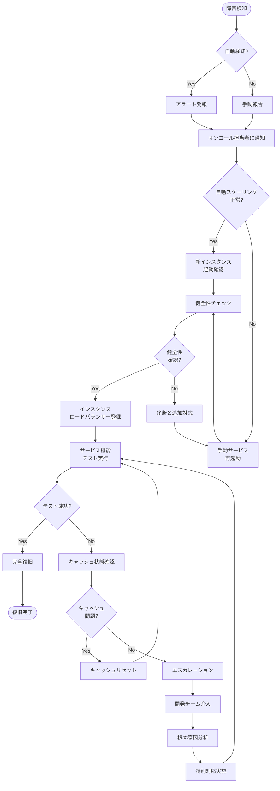

#### 2.3.7 障害設計・リカバリー設計書

障害設計・リカバリー設計書は、システム障害の検出、対応、復旧のための戦略と仕組みを定義するドキュメントです。AI駆動開発では、AIの支援を受けて網羅的な障害パターンの検出と最適なリカバリー戦略の立案を行い、構造化された形式で管理します。

##### JSON形式の障害設計・リカバリー設計スキーマ

```json
{
  "$schema": "https://json-schema.org/draft/2020-12/schema",
  "$id": "https://example.com/disaster-recovery-design-schema.json",
  "title": "障害設計・リカバリー設計書スキーマ",
  "description": "システム障害対応とリカバリー戦略を定義するためのスキーマ",
  "type": "object",
  "required": ["document_info", "system_resilience_strategy", "failure_scenarios", "recovery_plans"],
  "properties": {
    "document_info": {
      "type": "object",
      "required": ["title", "version", "last_updated", "status"],
      "properties": {
        "title": { "type": "string" },
        "project_name": { "type": "string" },
        "version": { "type": "string", "pattern": "^\\d+\\.\\d+\\.\\d+$" },
        "last_updated": { "type": "string", "format": "date-time" },
        "status": { "type": "string", "enum": ["draft", "review", "approved", "obsolete"] },
        "authors": { "type": "array", "items": { "type": "string" } }
      }
    },
    "system_resilience_strategy": {
      "type": "object",
      "required": ["high_availability_approach", "redundancy_strategy", "data_protection_strategy"],
      "properties": {
        "high_availability_approach": { "type": "string" },
        "availability_target": { 
          "type": "object",
          "properties": {
            "uptime_percentage": { "type": "number", "minimum": 0, "maximum": 100 },
            "max_allowed_downtime": {
              "type": "object",
              "properties": {
                "value": { "type": "number", "minimum": 0 },
                "unit": { "type": "string", "enum": ["minutes", "hours", "days"] }
              }
            }
          }
        },
        "redundancy_strategy": { "type": "string" },
        "data_protection_strategy": { "type": "string" },
        "disaster_recovery_tier": { 
          "type": "string", 
          "enum": ["tier0", "tier1", "tier2", "tier3", "tier4"] 
        }
      }
    },
    "failure_scenarios": {
      "type": "array",
      "items": {
        "type": "object",
        "required": ["id", "category", "title", "description", "impact", "detection_mechanism"],
        "properties": {
          "id": { "type": "string", "pattern": "^FS-[0-9]{3}$" },
          "category": { 
            "type": "string", 
            "enum": ["infrastructure", "network", "application", "data", "security", "external_dependency", "human_error"] 
          },
          "title": { "type": "string" },
          "description": { "type": "string" },
          "impact": {
            "type": "object",
            "properties": {
              "severity": { "type": "string", "enum": ["critical", "high", "medium", "low"] },
              "affected_components": { 
                "type": "array", 
                "items": { "type": "string" } 
              },
              "affected_functionality": { "type": "string" },
              "business_impact": { "type": "string" },
              "estimated_mttr": {
                "type": "object",
                "properties": {
                  "value": { "type": "number", "minimum": 0 },
                  "unit": { "type": "string", "enum": ["minutes", "hours", "days"] }
                }
              }
            }
          },
          "likelihood": { "type": "string", "enum": ["very_high", "high", "medium", "low", "very_low"] },
          "detection_mechanism": {
            "type": "object",
            "properties": {
              "method": { "type": "string" },
              "metrics": { "type": "array", "items": { "type": "string" } },
              "thresholds": { "type": "array", "items": { "type": "string" } },
              "monitoring_tools": { "type": "array", "items": { "type": "string" } },
              "alert_channels": { "type": "array", "items": { "type": "string" } }
            }
          },
          "prevention_measures": {
            "type": "array",
            "items": { "type": "string" }
          },
          "related_requirements": {
            "type": "array",
            "items": { "type": "string" }
          }
        }
      }
    },
    "recovery_plans": {
      "type": "array",
      "items": {
        "type": "object",
        "required": ["id", "failure_scenario_id", "name", "recovery_strategy", "recovery_procedures"],
        "properties": {
          "id": { "type": "string", "pattern": "^RP-[0-9]{3}$" },
          "failure_scenario_id": { "type": "string", "pattern": "^FS-[0-9]{3}$" },
          "name": { "type": "string" },
          "recovery_objective": {
            "type": "object",
            "properties": {
              "rto": {
                "type": "object",
                "description": "Recovery Time Objective",
                "properties": {
                  "value": { "type": "number", "minimum": 0 },
                  "unit": { "type": "string", "enum": ["seconds", "minutes", "hours", "days"] }
                }
              },
              "rpo": {
                "type": "object",
                "description": "Recovery Point Objective",
                "properties": {
                  "value": { "type": "number", "minimum": 0 },
                  "unit": { "type": "string", "enum": ["seconds", "minutes", "hours", "days"] }
                }
              }
            }
          },
          "recovery_strategy": { "type": "string" },
          "recovery_procedures": {
            "type": "array",
            "items": {
              "type": "object",
              "required": ["step_number", "description", "responsible_role"],
              "properties": {
                "step_number": { "type": "integer", "minimum": 1 },
                "description": { "type": "string" },
                "responsible_role": { "type": "string" },
                "estimated_duration": {
                  "type": "object",
                  "properties": {
                    "value": { "type": "number", "minimum": 0 },
                    "unit": { "type": "string", "enum": ["minutes", "hours", "days"] }
                  }
                },
                "automation_status": { 
                  "type": "string", 
                  "enum": ["fully_automated", "partially_automated", "manual_with_tools", "fully_manual"] 
                },
                "verification_method": { "type": "string" }
              }
            }
          },
          "required_resources": {
            "type": "array",
            "items": {
              "type": "object",
              "properties": {
                "resource_type": { "type": "string" },
                "description": { "type": "string" },
                "source": { "type": "string" }
              }
            }
          },
          "communication_plan": {
            "type": "object",
            "properties": {
              "stakeholders_to_notify": { 
                "type": "array", 
                "items": { "type": "string" } 
              },
              "communication_channels": { 
                "type": "array", 
                "items": { "type": "string" } 
              },
              "message_templates": { 
                "type": "array", 
                "items": { "type": "string" } 
              }
            }
          },
          "testing_schedule": {
            "type": "object",
            "properties": {
              "frequency": { "type": "string" },
              "last_tested": { "type": "string", "format": "date-time" },
              "test_results_location": { "type": "string" }
            }
          }
        }
      }
    },
    "disaster_recovery_testing": {
      "type": "object",
      "properties": {
        "testing_strategy": { "type": "string" },
        "testing_types": {
          "type": "array",
          "items": {
            "type": "object",
            "properties": {
              "test_type": { "type": "string" },
              "description": { "type": "string" },
              "frequency": { "type": "string" },
              "prerequisites": { "type": "array", "items": { "type": "string" } }
            }
          }
        },
        "drills_schedule": {
          "type": "array",
          "items": {
            "type": "object",
            "properties": {
              "scenario": { "type": "string" },
              "planned_date": { "type": "string", "format": "date" },
              "participants": { "type": "array", "items": { "type": "string" } }
            }
          }
        }
      }
    },
    "improvement_process": {
      "type": "object",
      "properties": {
        "post_incident_review": { "type": "string" },
        "metrics_tracking": {
          "type": "array",
          "items": {
            "type": "object",
            "properties": {
              "metric_name": { "type": "string" },
              "description": { "type": "string" },
              "target": { "type": "string" }
            }
          }
        },
        "continuous_improvement_cycle": { "type": "string" }
      }
    }
  }
}
```

##### 障害設計・リカバリー設計のJSON構造例

```json
{
  "document_info": {
    "id": "DR-001",
    "title": "顧客管理システム - 障害設計・リカバリー設計書",
    "project_name": "顧客管理システム刷新",
    "version": "1.0.0",
    "last_updated": "2025-03-15T10:00:00Z",
    "status": "approved",
    "authors": ["システム設計チーム", "インフラストラクチャチーム"],
    "document_type": "disaster_recovery_design",
    "dependencies": [
      {
        "document_id": "ARCH-001",
        "relationship": "implements"
      },
      {
        "document_id": "INFRA-001",
        "relationship": "references"
      }
    ]
  },
  "document_history": [
    {
      "version": "0.5.0",
      "date": "2025-03-05T13:00:00Z",
      "description": "初期ドラフト作成",
      "authors": ["システム設計チーム"]
    },
    {
      "version": "0.8.0",
      "date": "2025-03-10T11:00:00Z",
      "description": "インフラチームのレビュー反映",
      "authors": ["システム設計チーム", "インフラストラクチャチーム"]
    },
    {
      "version": "1.0.0",
      "date": "2025-03-15T10:00:00Z",
      "description": "正式版リリース",
      "authors": ["システム設計チーム", "インフラストラクチャチーム"]
    }
  ],
  "system_resilience_strategy": {
    "high_availability_approach": "リージョン内マルチAZ配置によるActive-Active構成",
    "availability_target": {
      "uptime_percentage": 99.95,
      "max_allowed_downtime": {
        "value": 4.38,
        "unit": "hours"
      }
    },
    "redundancy_strategy": "N+1冗長化（すべての主要コンポーネント）、データベースMulti-AZレプリケーション",
    "data_protection_strategy": "Point-in-Timeリカバリ対応バックアップ（15分間隔）、クロスリージョンスナップショット（日次）",
    "disaster_recovery_tier": "tier2"
  },
  "failure_scenarios": [
    {
      "id": "FS-001",
      "category": "infrastructure",
      "title": "プライマリデータベースの障害",
      "description": "プライマリデータベースサーバーのハードウェア障害、ソフトウェアクラッシュ、またはストレージ障害によって、データベースが利用できなくなる状況",
      "impact": {
        "severity": "critical",
        "affected_components": ["データレイヤー", "バックエンドAPI", "管理機能"],
        "affected_functionality": "すべての読み取り/書き込み操作",
        "business_impact": "すべてのビジネストランザクションが中断。顧客データにアクセスできず、新規登録や更新ができなくなる",
        "estimated_mttr": {
          "value": 30,
          "unit": "minutes"
        }
      },
      "likelihood": "low",
      "detection_mechanism": {
        "method": "ヘルスチェックの失敗とメトリクス異常の複合検出",
        "metrics": ["DB接続エラー率", "レイテンシ", "CPUとメモリ使用率"],
        "thresholds": ["接続エラー率 > 10%", "クエリレイテンシ > 5秒", "CPU使用率 > 90%が5分間継続"],
        "monitoring_tools": ["Amazon CloudWatch", "Prometheus", "カスタムヘルスチェックAPI"],
        "alert_channels": ["PagerDuty", "Slackアラートチャンネル", "SMS通知"]
      },
      "prevention_measures": [
        "Multi-AZデプロイメントによる自動フェイルオーバー",
        "定期的なバックアップと復元テスト",
        "パフォーマンスメトリクスの事前監視と異常検出"
      ],
      "related_requirements": ["NFR-R-001", "NFR-P-002"]
    },
    {
      "id": "FS-002",
      "category": "application",
      "title": "認証サービスの障害",
      "description": "ユーザー認証・認可を処理するマイクロサービスが応答しなくなるか、エラーを返す状況",
      "impact": {
        "severity": "high",
        "affected_components": ["認証サービス", "すべてのセキュアなAPI"],
        "affected_functionality": "ログイン、トークン検証、権限確認",
        "business_impact": "ユーザーがシステムにログインできない。既存セッションはトークン有効期限まで機能する可能性あり",
        "estimated_mttr": {
          "value": 15,
          "unit": "minutes"
        }
      },
      "likelihood": "medium",
      "detection_mechanism": {
        "method": "API健全性チェックとエラーレート監視",
        "metrics": ["5xxエラーレート", "認証リクエスト成功率", "レスポンスタイム"],
        "thresholds": ["5xxエラー > 5%", "認証成功率 < 95%", "レスポンスタイム > 2秒"],
        "monitoring_tools": ["API Gateway メトリクス", "CloudWatch", "Datadog"],
        "alert_channels": ["PagerDuty", "Slackアラートチャンネル"]
      },
      "prevention_measures": [
        "サービスの水平スケーリングと負荷分散",
        "サーキットブレーカーパターンの実装",
        "トークンキャッシュとグレースフルデグラデーション戦略",
        "定期的なカオステスティング"
      ],
      "related_requirements": ["NFR-S-001", "NFR-R-003"]
    }
  ],
  "recovery_plans": [
    {
      "id": "RP-001",
      "failure_scenario_id": "FS-001",
      "name": "データベースフェイルオーバーと復旧プラン",
      "recovery_objective": {
        "rto": {
          "value": 15,
          "unit": "minutes"
        },
        "rpo": {
          "value": 5,
          "unit": "minutes"
        }
      },
      "recovery_strategy": "自動フェイルオーバーをプライマリ対応とし、手動介入をバックアップとする。データ整合性確認後にサービスを完全復旧させる",
      "recovery_procedures": [
        {
          "step_number": 1,
          "description": "AWSマネージドデータベースサービスの自動フェイルオーバーが完了するのを確認",
          "responsible_role": "データベース管理者",
          "estimated_duration": {
            "value": 5,
            "unit": "minutes"
          },
          "automation_status": "fully_automated",
          "verification_method": "CloudWatchのデータベースステータスを確認"
        },
        {
          "step_number": 2,
          "description": "スタンバイインスタンスへの接続が確立されたことを確認",
          "responsible_role": "データベース管理者",
          "estimated_duration": {
            "value": 2,
            "unit": "minutes"
          },
          "automation_status": "partially_automated",
          "verification_method": "データベース接続テストの実行"
        },
        {
          "step_number": 3,
          "description": "自動フェイルオーバーが失敗した場合、手動でスタンバイをプライマリに昇格させる",
          "responsible_role": "データベース管理者",
          "estimated_duration": {
            "value": 10,
            "unit": "minutes"
          },
          "automation_status": "manual_with_tools",
          "verification_method": "AWS CLIでの確認と接続テスト"
        },
        {
          "step_number": 4,
          "description": "アプリケーションサーバーがスタンバイDBへ正常に接続していることを確認",
          "responsible_role": "システム管理者",
          "estimated_duration": {
            "value": 3,
            "unit": "minutes"
          },
          "automation_status": "partially_automated",
          "verification_method": "アプリケーションログとヘルスエンドポイントの確認"
        },
        {
          "step_number": 5,
          "description": "データベーストランザクションの整合性を確認",
          "responsible_role": "データベース管理者",
          "estimated_duration": {
            "value": 5,
            "unit": "minutes"
          },
          "automation_status": "partially_automated",
          "verification_method": "整合性確認SQLスクリプトの実行"
        }
      ],
      "required_resources": [
        {
          "resource_type": "アクセス権限",
          "description": "AWS RDS管理者権限",
          "source": "IAMロール: DBAdminRole"
        },
        {
          "resource_type": "ツール",
          "description": "データベース接続テストスクリプト",
          "source": "GitHub: db-scripts/connection-test.sh"
        },
        {
          "resource_type": "ドキュメント",
          "description": "AWS RDS手動フェイルオーバー手順",
          "source": "社内Wiki: DB-Failover-Procedure"
        }
      ],
      "communication_plan": {
        "stakeholders_to_notify": [
          "開発チームリード",
          "運用チーム",
          "カスタマーサポート部門",
          "影響を受けるユーザー"
        ],
        "communication_channels": [
          "Slack #incidents チャンネル",
          "緊急メーリングリスト",
          "ステータスページの更新"
        ],
        "message_templates": [
          "INCIDENT_START: データベース障害が検出され、自動復旧プロセスが開始されました。サービスは部分的に影響を受けている可能性があります。",
          "RECOVERY_IN_PROGRESS: データベースフェイルオーバーが進行中です。一部機能が一時的に利用できない場合があります。",
          "INCIDENT_RESOLVED: データベース復旧が完了し、すべてのサービスが正常に動作しています。影響期間: {start_time} から {end_time}まで。"
        ]
      },
      "testing_schedule": {
        "frequency": "四半期ごと",
        "last_tested": "2025-02-15T09:00:00Z",
        "test_results_location": "SharePoint: DR-Test-Results/2025-Q1/DB-Failover-Test.pdf"
      }
    },
    {
      "id": "RP-002",
      "failure_scenario_id": "FS-002",
      "name": "認証サービス復旧プラン",
      "recovery_objective": {
        "rto": {
          "value": 10,
          "unit": "minutes"
        },
        "rpo": {
          "value": 0,
          "unit": "minutes"
        }
      },
      "recovery_strategy": "自動スケーリングと自己修復を主体とし、必要に応じて手動介入によるサービス再起動と構成変更を行う",
      "recovery_procedures": [
        {
          "step_number": 1,
          "description": "自動スケーリングが新しいインスタンスを起動したことを確認",
          "responsible_role": "システム管理者",
          "estimated_duration": {
            "value": 3,
            "unit": "minutes"
          },
          "automation_status": "fully_automated",
          "verification_method": "CloudWatch Auto Scaling Groupメトリクスの確認"
        },
        {
          "step_number": 2,
          "description": "健全性チェックに合格したインスタンスがロードバランサーに登録されているか確認",
          "responsible_role": "システム管理者",
          "estimated_duration": {
            "value": 2,
            "unit": "minutes"
          },
          "automation_status": "partially_automated",
          "verification_method": "ELBインスタンスステータス確認"
        },
        {
          "step_number": 3,
          "description": "自動復旧が不十分な場合、認証サービスクラスタを強制再起動",
          "responsible_role": "DevOps担当者",
          "estimated_duration": {
            "value": 5,
            "unit": "minutes"
          },
          "automation_status": "manual_with_tools",
          "verification_method": "Kubernetes再起動コマンドと結果確認"
        },
        {
          "step_number": 4,
          "description": "認証エンドポイントの機能テスト実行",
          "responsible_role": "QAエンジニア",
          "estimated_duration": {
            "value": 3,
            "unit": "minutes"
          },
          "automation_status": "partially_automated",
          "verification_method": "認証API統合テストスイートの実行"
        },
        {
          "step_number": 5,
          "description": "キャッシュの状態確認と必要に応じてリセット",
          "responsible_role": "開発者",
          "estimated_duration": {
            "value": 2,
            "unit": "minutes"
          },
          "automation_status": "manual_with_tools",
          "verification_method": "Redis CLIでのキャッシュステータス確認"
        }
      ],
      "required_resources": [
        {
          "resource_type": "アクセス権限",
          "description": "Kubernetes管理者権限",
          "source": "K8sロール: ClusterAdmin"
        },
        {
          "resource_type": "ツール",
          "description": "認証サービス診断ツール",
          "source": "GitHub: ops-tools/auth-service-diagnostics.js"
        }
      ],
      "communication_plan": {
        "stakeholders_to_notify": [
          "開発チームリード",
          "セキュリティチーム",
          "カスタマーサポート"
        ],
        "communication_channels": [
          "Slack #auth-service チャンネル",
          "緊急メーリングリスト"
        ],
        "message_templates": [
          "認証サービスで障害が検出されました。一時的にログインできない可能性があります。現在復旧作業中です。",
          "認証サービスが復旧し、ログイン機能が正常に動作しています。"
        ]
      },
      "testing_schedule": {
        "frequency": "月1回",
        "last_tested": "2025-03-01T14:30:00Z",
        "test_results_location": "SharePoint: DR-Test-Results/2025-03/Auth-Service-Recovery-Test.pdf"
      }
    }
  ],
  "disaster_recovery_testing": {
    "testing_strategy": "定期的なDRテスト（シミュレーション、コンポーネントテスト、フルDRシナリオ）と結果のフィードバックに基づく継続的な改善",
    "testing_types": [
      {
        "test_type": "コンポーネント単体障害テスト",
        "description": "個別のコンポーネント（DB、認証サービス等）の障害をシミュレーションし、自動復旧メカニズムをテスト",
        "frequency": "月1回ローテーション（各コンポーネント四半期に1回）",
        "prerequisites": ["非本番環境での事前リハーサル", "監視アラート検証", "ロールバック手順確認"]
      },
      {
        "test_type": "カオステスト",
        "description": "実稼働環境で予告なく小規模障害を発生させ、システムの回復力を検証",
        "frequency": "2週間に1回",
        "prerequisites": ["業務影響の少ない時間帯での実施", "即時中断可能な仕組み"]
      },
      {
        "test_type": "フルDRシナリオテスト",
        "description": "大規模障害を想定し、全体復旧プロセスを検証（リージョン障害等）",
        "frequency": "半年に1回",
        "prerequisites": ["経営陣の承認", "ユーザー通知", "本番類似環境の確保"]
      }
    ],
    "drills_schedule": [
      {
        "scenario": "リージョン間フェイルオーバー訓練",
        "planned_date": "2025-06-15",
        "participants": ["インフラチーム", "開発チーム", "QAチーム", "セキュリティチーム"]
      },
      {
        "scenario": "データ破損からのリカバリー訓練",
        "planned_date": "2025-09-20",
        "participants": ["データベース管理者", "開発チーム", "QAチーム"]
      }
    ]
  },
  "improvement_process": {
    "post_incident_review": "すべての重大インシデント（計画外ダウンタイム、SLA違反）後に必須でレビューを実施。根本原因分析、タイムライン作成、改善点特定、再発防止策の文書化を行う。",
    "metrics_tracking": [
      {
        "metric_name": "平均復旧時間（MTTR）",
        "description": "障害検知から完全復旧までの平均時間",
        "target": "Severity Criticalで15分以内、Highで30分以内"
      },
      {
        "metric_name": "復旧成功率",
        "description": "自動復旧メカニズムが正常に機能した割合",
        "target": "95%以上"
      },
      {
        "metric_name": "平均検知時間",
        "description": "障害発生から検知までの平均時間",
        "target": "5分以内"
      }
    ],
    "continuous_improvement_cycle": "四半期ごとにメトリクス分析、DRテスト結果レビュー、新技術評価を行い、改善計画を更新。半年ごとに全体的なDR戦略の見直しを実施。"
  }
}
```

##### AIを活用した障害設計・リカバリー設計のプロセス

AI駆動開発アプローチでは、障害設計・リカバリー設計の各段階でAIを活用して、設計の質と効率を高めることができます。以下に、主要なプロセスとAIの活用方法を示します：

1. **AIによる障害シナリオの洗い出しと分析**

AIに対して、システムの構成情報やアーキテクチャ設計を入力として与え、潜在的な障害シナリオを網羅的に分析させることができます。以下は、AIに障害シナリオを生成させるプロンプト例です：

```
以下のシステム構成とアーキテクチャ情報に基づいて、考えられる障害シナリオを網羅的に分析してください：

【システム概要】
- マイクロサービスアーキテクチャ（12サービス）
- AWSインフラ（ECS, RDS, ElastiCache, S3）
- リージョン冗長化なし、AZ冗長あり
- 外部APIとの連携（決済、地図サービス）

障害シナリオは以下のカテゴリごとに分類し、各シナリオには：
1. 障害の説明と影響範囲
2. 発生可能性の見積り
3. 考えられる検知方法
4. 推奨される予防策

を含めてください。出力はJSONフォーマットで提供してください。
```

AIはこうした指示に基づき、以下のような障害シナリオを生成します：

- インフラストラクチャ障害（AWSリージョン障害、AZ障害など）
- ネットワーク障害（接続問題、遅延増加、DNS障害など）
- アプリケーション障害（メモリリーク、デッドロック、依存関係障害など）
- データ関連障害（整合性破壊、バックアップ失敗、キャッシュ問題など）
- セキュリティインシデント（DDoS攻撃、権限昇格、データ漏洩など）
- 外部依存障害（サードパーティAPIダウン、SaaS障害など）
- 人的ミス（誤った設定変更、アクセス権限問題など）

2. **AIによるリカバリー戦略の提案**

特定した障害シナリオごとに、AIにリカバリー戦略を提案させることができます。以下はプロンプト例です：

```
以下の障害シナリオに対する最適なリカバリー戦略と具体的な手順を提案してください：

【障害シナリオ】
ID: FS-001
カテゴリ: インフラストラクチャ
タイトル: プライマリデータベースの障害
説明: プライマリデータベースサーバーのハードウェア障害、ソフトウェアクラッシュ、
     またはストレージ障害によって、データベースが利用できなくなる状況
影響: 重大（システム全体のトランザクション処理不能）

【システム制約】
- AWS RDS PostgreSQLを使用
- Multi-AZ配置済み
- RTO目標: 15分以内
- RPO目標: 5分以内

リカバリー戦略には以下を含めてください：
1. 自動化可能な復旧手順と人間の介入が必要な手順の明確な区別
2. 各ステップに必要なツール、権限、リソース
3. 検証方法と成功基準
4. 通知すべき関係者と通知方法
```

AIはこうした情報を分析し、最適なリカバリー戦略を提案します。技術的な知見と業界のベストプラクティスを組み合わせて、実現可能で効果的な復旧計画を立案します。

3. **JSON Logicを活用したリカバリーロジック表現**

複雑なリカバリーロジックは、JSON Logicを用いて構造化できます。特に、障害検知の条件とそれに対応するアクションをルールベースで表現するのに適しています。例えば：

```json
{
  "detection_rule": {
    "and": [
      {">=": [{"var": "error_rate"}, 10]},
      {">=": [{"var": "response_time_p95"}, 2000]},
      {">=": [{"var": "duration_seconds"}, 60]}
    ]
  },
  "actions": [
    {
      "if": [
        {"==": [{"var": "auto_recovery_attempts"}, 0]},
        {"action": "trigger_auto_recovery"},
        {"if": [
          {"<": [{"var": "auto_recovery_attempts"}, 3]},
          {"action": "retry_auto_recovery"},
          {"action": "escalate_to_human"}
        ]}
      ]
    }
  ]
}
```

このようなJSON Logicは、障害管理システムやモニタリングツールで直接解釈・実行することも可能です。

4. **AIによる設計レビューと改善提案**

障害設計・リカバリー設計が完成した後、AIに設計全体をレビューさせ、改善点を提案させることができます。以下はプロンプト例です：

```
以下の障害設計・リカバリー設計書を分析し、以下の観点でレビューしてください：

1. 網羅性：考慮すべき障害シナリオの漏れはないか
2. 実現可能性：各リカバリー手順は実装可能で、時間制約内に完了するか
3. テスト可能性：各リカバリー計画は適切にテスト可能か
4. ベストプラクティス：業界標準と比較して改善すべき点はあるか
5. 一貫性：RTOやRPOなどの目標は全体として整合しているか

特に自動化の可能性が高い部分、単一障害点のリスク、ドキュメントの不明確な点を
重点的に指摘してください。

【障害設計・リカバリー設計書】
{設計書のJSON}
```

AIは上記のような指示を受けて、設計の弱点や改善の機会を特定し、具体的な改善提案を提供します。

5. **設計変更の影響分析**

設計変更が必要になった場合、AIを活用して変更の影響範囲を分析することができます：

```
以下の設計変更が障害対応設計に与える影響を分析してください：

【設計変更】
- プライマリデータベースをAWS RDSからAurora Serverlessに移行
- バックアップ戦略をスナップショットからContinuous Backupに変更
- RTO目標を15分から5分に短縮

【現行の障害設計・リカバリー設計書】
{現行設計書のJSON}

変更が必要となる設計要素と、それらの更新案を提案してください。
特に、既存のリカバリープロセスへの影響と自動化の拡張可能性に注目してください。
```

##### 障害設計・リカバリー設計の検証と改善サイクル

AI駆動開発では、障害設計・リカバリー設計の継続的な検証と改善が重要です。以下のサイクルを確立することで、設計の品質と実効性を高めることができます：

1. **シミュレーションによる検証**

AIを活用して障害シナリオのシミュレーションを行い、リカバリー計画の実効性を検証できます：

```json
{
  "jsonrpc": "2.0",
  "method": "simulate_disaster_recovery",
  "params": {
    "failure_scenario_id": "FS-001",
    "recovery_plan_id": "RP-001",
    "simulation_parameters": {
      "response_time_degradation": "linear",
      "degradation_rate": 200,
      "auto_recovery_success_probability": 0.95,
      "manual_intervention_delay": 300
    },
    "simulation_iterations": 1000
  },
  "id": "sim-2025-03-15-001"
}
```

このようなシミュレーションを通じて、リカバリープランの成功確率、平均復旧時間、最悪ケースのシナリオなどを予測できます。

2. **カオスエンジニアリングの適用**

Netflix社が先駆けとなったカオスエンジニアリングの手法を取り入れ、実際の環境で計画的な障害注入を行うことで、システムの回復力を実証的に検証します。AIはこうしたカオステストのシナリオ設計や結果分析に活用できます：

```
以下のシステム構成に対する効果的なカオステストシナリオを5つ設計してください：

【システム構成】
{システム構成の詳細}

各シナリオには以下を含めてください：
1. テストの目的
2. 注入する障害の種類と方法
3. 期待される挙動
4. 観察すべきメトリクスとログ
5. 安全メカニズム（テスト中断条件）
```

3. **継続的なフィードバックループ**

実際の障害対応からのフィードバックと教訓を、設計に継続的に取り込むプロセスを確立します：

```
以下の障害インシデントレポートを分析し、現行の障害設計・リカバリー設計書の改善点を特定してください：

【インシデントレポート】
インシデントID: INC-2025-03-10-001
関連障害シナリオ: FS-002（認証サービスの障害）
実際の検知時間: 3分42秒
実際の復旧時間: 27分15秒（目標: 10分）
根本原因: キャッシュサーバーのメモリ枯渇による応答遅延

インシデント対応の課題:
- 自動スケーリングが問題を検出できなかった
- キャッシュリセット手順が明確でなく時間を要した
- 関係者への通知が遅れた

現行設計書をこの経験に基づいて更新し、同様のインシデントに対する対応を改善するための
具体的な変更を提案してください。
```

AIはこうした分析を通じて、実際の経験に基づいた設計改善を提案します。

##### 実践ポイントと注意事項

障害設計・リカバリー設計を効果的に行うための実践ポイントと注意事項を以下に示します：

1. **バランスの取れた自動化**
   - 完全自動化を目指すのではなく、人間の判断が必要な場面と自動化すべき部分を適切に区別する
   - 自動化システム自体の障害可能性も考慮し、代替手段を常に用意しておく

2. **設計の定期的な見直し**
   - システムの進化に合わせて、少なくとも四半期に1回は障害設計・リカバリー設計を見直す
   - 新技術や新しいベストプラクティスを積極的に取り入れる

3. **シンプルさの維持**
   - 複雑なリカバリー手順は障害時に実行が困難になる可能性が高い
   - 「可能な限りシンプルに、必要な複雑さだけ導入する」原則を守る

4. **演習と訓練の実施**
   - リカバリー手順を実際に実行する定期的な訓練が重要
   - 手順だけでなくツールの使い方や権限アクセスも含めて検証する

5. **コミュニケーション計画の重視**
   - 技術的な復旧手順と同等に、ステークホルダーとのコミュニケーション計画を重視する
   - 明確なエスカレーションパスと責任分担を定義しておく

6. **AIに過度に依存しない**
   - AIは強力なツールだが、最終判断は人間が行うべき
   - AIの提案は常に人間のレビューを経てから採用する

##### Mermaidを使った障害対応フロー視覚化

JSON形式で構造化された障害対応計画は、Mermaidを使って視覚的に表現できます。以下は認証サービス障害（FS-002）に対するリカバリープロセスをMermaidで表現した例です：



この図表は、JSON形式の復旧手順からAIによって自動生成することも可能です。以下にAIに図表生成を依頼するプロンプト例を示します：

```
以下のJSON形式のリカバリープラン（RP-002）を分析し、Mermaid記法を使って
障害検知から復旧完了までのフロー図を生成してください。
主要な判断ポイントと代替パスを含め、視覚的に分かりやすく表現してください。

【リカバリープラン】
{
  "id": "RP-002",
  "failure_scenario_id": "FS-002",
  "name": "認証サービス復旧プラン",
  ...
}
```

このように構造化された障害対応フローを視覚化することで、関係者間での理解共有や訓練時の参照が容易になります。
