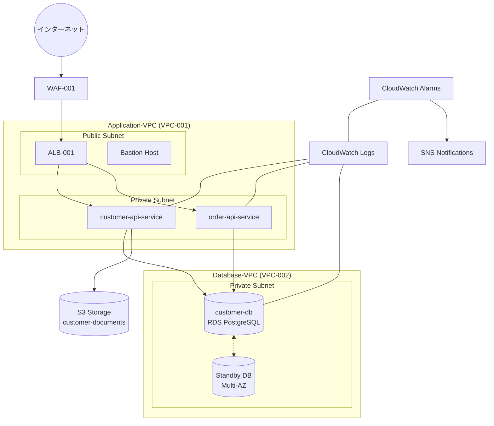

#### 2.3.8 インフラ構成図

インフラ構成図は、システムの物理的・論理的なインフラストラクチャ要素とその関係性を定義する設計書です。AI駆動開発では、インフラ構成もコード化（Infrastructure as Code）し、要件や他の設計書との一貫性を保ちながら、AI支援による最適なインフラ設計を目指します。

##### インフラ構成図のJSON構造例

```json
{
  "document_info": {
    "id": "INFRA-001",
    "title": "顧客管理システム インフラ構成",
    "project_name": "顧客管理システム刷新",
    "version": "1.0.0",
    "last_updated": "2025-03-10T14:30:00Z",
    "status": "approved",
    "authors": ["インフラストラクチャチーム"],
    "document_type": "infrastructure_diagram",
    "dependencies": [
      {
        "document_id": "ARCH-001",
        "relationship": "implements"
      },
      {
        "document_id": "SEC-001",
        "relationship": "implements"
      }
    ]
  },
  "infrastructure_settings": {
    "environment": "production",
    "architecture_type": "microservices",
    "deployment_model": "hybrid-cloud"
  },
  "document_history": [
    {
      "version": "0.5.0",
      "date": "2025-03-01T10:00:00Z",
      "description": "初期インフラ設計",
      "authors": ["インフラストラクチャチーム"]
    },
    {
      "version": "1.0.0",
      "date": "2025-03-10T14:30:00Z",
      "description": "正式版リリース",
      "authors": ["インフラストラクチャチーム"]
    }
  ],
  "network": {
    "overview": {
      "vpc_count": 2,
      "subnet_count": 8,
      "connectivity_type": "transit_gateway"
    },
    "vpcs": [
      {
        "id": "VPC-001",
        "name": "Application-VPC",
        "cidr": "10.0.0.0/16",
        "region": "ap-northeast-1",
        "subnets": [
          {
            "id": "SUBNET-001",
            "name": "App-Public-1a",
            "cidr": "10.0.0.0/24",
            "availability_zone": "ap-northeast-1a",
            "type": "public"
          },
          {
            "id": "SUBNET-002",
            "name": "App-Private-1a",
            "cidr": "10.0.1.0/24",
            "availability_zone": "ap-northeast-1a",
            "type": "private"
          },
          {
            "id": "SUBNET-003",
            "name": "App-Public-1c",
            "cidr": "10.0.2.0/24",
            "availability_zone": "ap-northeast-1c",
            "type": "public"
          },
          {
            "id": "SUBNET-004",
            "name": "App-Private-1c",
            "cidr": "10.0.3.0/24",
            "availability_zone": "ap-northeast-1c",
            "type": "private"
          }
        ]
      },
      {
        "id": "VPC-002",
        "name": "Database-VPC",
        "cidr": "10.1.0.0/16",
        "region": "ap-northeast-1",
        "subnets": [
          {
            "id": "SUBNET-005",
            "name": "DB-Private-1a",
            "cidr": "10.1.0.0/24",
            "availability_zone": "ap-northeast-1a",
            "type": "private"
          },
          {
            "id": "SUBNET-006",
            "name": "DB-Private-1c",
            "cidr": "10.1.1.0/24",
            "availability_zone": "ap-northeast-1c",
            "type": "private"
          }
        ]
      }
    ],
    "security_groups": [
      {
        "id": "SG-001",
        "name": "ALB-SG",
        "vpc_id": "VPC-001",
        "inbound_rules": [
          {
            "protocol": "HTTPS",
            "port": 443,
            "source": "0.0.0.0/0",
            "description": "HTTPSリクエスト受付"
          }
        ],
        "outbound_rules": [
          {
            "protocol": "All",
            "port": "All",
            "destination": "0.0.0.0/0",
            "description": "全ての送信トラフィックを許可"
          }
        ]
      },
      {
        "id": "SG-002",
        "name": "App-SG",
        "vpc_id": "VPC-001",
        "inbound_rules": [
          {
            "protocol": "HTTP",
            "port": 80,
            "source": "SG-001",
            "description": "ALBからのトラフィックのみ受付"
          }
        ],
        "outbound_rules": [
          {
            "protocol": "All",
            "port": "All",
            "destination": "0.0.0.0/0",
            "description": "全ての送信トラフィックを許可"
          }
        ]
      },
      {
        "id": "SG-003",
        "name": "DB-SG",
        "vpc_id": "VPC-002",
        "inbound_rules": [
          {
            "protocol": "PostgreSQL",
            "port": 5432,
            "source": "SG-002",
            "description": "アプリケーションサーバーからの接続のみ許可"
          }
        ],
        "outbound_rules": [
          {
            "protocol": "All",
            "port": "All",
            "destination": "0.0.0.0/0",
            "description": "全ての送信トラフィックを許可"
          }
        ]
      }
    ]
  },
  "compute": {
    "containers": {
      "orchestration": "ECS",
      "clusters": [
        {
          "id": "CLS-001",
          "name": "app-cluster",
          "type": "FARGATE",
          "services": [
            {
              "id": "SVC-001",
              "name": "customer-api-service",
              "task_definition": "customer-api:latest",
              "desired_count": 4,
              "auto_scaling": {
                "min_capacity": 2,
                "max_capacity": 10,
                "scaling_policy": {
                  "metric": "CPU_UTILIZATION",
                  "target_value": 70
                }
              },
              "health_check": {
                "path": "/health",
                "interval": 30,
                "timeout": 5,
                "healthy_threshold": 3,
                "unhealthy_threshold": 3
              }
            },
            {
              "id": "SVC-002",
              "name": "order-api-service",
              "task_definition": "order-api:latest",
              "desired_count": 2,
              "auto_scaling": {
                "min_capacity": 1,
                "max_capacity": 5,
                "scaling_policy": {
                  "metric": "CPU_UTILIZATION",
                  "target_value": 70
                }
              },
              "health_check": {
                "path": "/health",
                "interval": 30,
                "timeout": 5,
                "healthy_threshold": 3,
                "unhealthy_threshold": 3
              }
            }
          ]
        }
      ]
    },
    "instances": [
      {
        "id": "EC2-001",
        "name": "bastion-host",
        "type": "t3.micro",
        "subnet_id": "SUBNET-001",
        "security_group_ids": ["SG-004"],
        "purpose": "運用管理用踏み台サーバー"
      }
    ]
  },
  "storage": {
    "databases": [
      {
        "id": "DB-001",
        "name": "customer-db",
        "type": "RDS",
        "engine": "PostgreSQL",
        "version": "14.5",
        "instance_type": "db.r6g.large",
        "storage": {
          "type": "gp3",
          "size_gb": 100,
          "iops": 3000
        },
        "multi_az": true,
        "subnet_group": ["SUBNET-005", "SUBNET-006"],
        "security_group_ids": ["SG-003"],
        "backup": {
          "retention_period_days": 7,
          "backup_window": "03:00-04:00",
          "automated_backups_enabled": true
        },
        "disaster_recovery": {
          "point_in_time_recovery": true,
          "cross_region_replica": {
            "enabled": true,
            "region": "ap-northeast-3"
          }
        }
      }
    ],
    "object_storage": [
      {
        "id": "S3-001",
        "name": "customer-documents",
        "lifecycle_rules": [
          {
            "id": "archive-rule",
            "prefix": "archived/",
            "transition": {
              "days": 90,
              "storage_class": "GLACIER"
            }
          }
        ],
        "versioning": true,
        "encryption": {
          "type": "SSE-KMS",
          "kms_key_id": "KMS-001"
        }
      }
    ],
    "file_storage": [
      {
        "id": "EFS-001",
        "name": "shared-files",
        "performance_mode": "generalPurpose",
        "throughput_mode": "bursting",
        "encrypted": true,
        "mount_targets": [
          {
            "subnet_id": "SUBNET-002",
            "security_group_ids": ["SG-005"]
          },
          {
            "subnet_id": "SUBNET-004",
            "security_group_ids": ["SG-005"]
          }
        ]
      }
    ]
  },
  "load_balancers": [
    {
      "id": "ALB-001",
      "name": "customer-app-alb",
      "type": "APPLICATION",
      "scheme": "internet-facing",
      "subnets": ["SUBNET-001", "SUBNET-003"],
      "security_groups": ["SG-001"],
      "listeners": [
        {
          "port": 443,
          "protocol": "HTTPS",
          "certificate_arn": "ACM-001",
          "default_action": {
            "type": "forward",
            "target_group_id": "TG-001"
          }
        }
      ],
      "target_groups": [
        {
          "id": "TG-001",
          "name": "customer-api-tg",
          "port": 80,
          "protocol": "HTTP",
          "target_type": "ip",
          "health_check": {
            "path": "/health",
            "port": "traffic-port",
            "healthy_threshold": 3,
            "unhealthy_threshold": 3,
            "timeout": 5,
            "interval": 30
          }
        }
      ]
    }
  ],
  "security": {
    "waf": {
      "id": "WAF-001",
      "name": "customer-app-waf",
      "associated_resources": ["ALB-001"],
      "rule_groups": [
        {
          "name": "common-threats",
          "type": "managed",
          "rules": ["AWS-AWSManagedRulesCommonRuleSet"]
        },
        {
          "name": "rate-limiting",
          "type": "custom",
          "rules": [
            {
              "name": "rate-limit-per-ip",
              "action": "block",
              "rate_limit": {
                "limit": 100,
                "time_window_in_minutes": 5
              }
            }
          ]
        }
      ]
    },
    "certificates": [
      {
        "id": "ACM-001",
        "domain": "app.example.com",
        "validation_method": "DNS",
        "renewable": true
      }
    ],
    "kms_keys": [
      {
        "id": "KMS-001",
        "description": "顧客データ暗号化キー",
        "key_rotation_enabled": true,
        "used_by": ["S3-001", "EFS-001", "DB-001"]
      }
    ]
  },
  "monitoring": {
    "log_groups": [
      {
        "id": "LOG-001",
        "name": "/aws/containerinsights/app-cluster",
        "retention_days": 30
      },
      {
        "id": "LOG-002",
        "name": "/aws/rds/instance/customer-db",
        "retention_days": 30
      }
    ],
    "alarms": [
      {
        "id": "ALARM-001",
        "name": "high-cpu-utilization",
        "description": "コンテナCPU使用率高負荷アラート",
        "metric": "CPUUtilization",
        "namespace": "AWS/ECS",
        "dimensions": {
          "ClusterName": "app-cluster",
          "ServiceName": "customer-api-service"
        },
        "comparison_operator": "GreaterThanThreshold",
        "threshold": 85,
        "period": 300,
        "evaluation_periods": 3,
        "statistic": "Average",
        "actions": ["SNS-001"]
      }
    ],
    "dashboards": [
      {
        "id": "DASH-001",
        "name": "system-overview",
        "widgets": ["cpu-usage", "memory-usage", "api-requests", "error-rate", "db-connections"]
      }
    ]
  },
  "disaster_recovery": {
    "strategy": "warm_standby",
    "secondary_region": "ap-northeast-3",
    "rpo_minutes": 15,
    "rto_minutes": 30,
    "components": [
      {
        "source_id": "DB-001",
        "replication_type": "continuous",
        "failover_automation": true
      },
      {
        "source_id": "S3-001",
        "replication_type": "continuous",
        "failover_automation": true
      }
    ]
  },
  "compliance": {
    "data_classification": "confidential",
    "regulatory_requirements": ["GDPR", "ISO27001"],
    "security_controls": [
      "encryption-at-rest",
      "encryption-in-transit",
      "multi-factor-authentication",
      "least-privilege-access"
    ]
  },
  "costs": {
    "estimated_monthly_cost": 5200,
    "currency": "USD",
    "cost_breakdown": {
      "compute": 2100,
      "storage": 950,
      "network": 600,
      "others": 1550
    },
    "cost_optimization_recommendations": [
      {
        "description": "Reserved Instancesの購入でRDS費用を25%削減可能",
        "potential_savings": 250,
        "implementation_complexity": "low"
      }
    ]
  }
}
```

##### AIを活用したインフラ構成図の作成プロセス

1. **要件からのインフラ推論**

非機能要件（性能、可用性、セキュリティなど）からインフラ構成を推論する例：

```json
{
  "jsonrpc": "2.0",
  "method": "infer_infrastructure",
  "params": {
    "project_name": "顧客管理システム",
    "non_functional_requirements_file": "requirements/structured/non_functional_requirements.json",
    "constraints": ["AWS環境", "マイクロサービスアーキテクチャ", "マルチAZ配置"],
    "estimated_load": {
      "concurrent_users": 150,
      "requests_per_second": 50,
      "data_volume_gb": 500
    },
    "budget_constraints": {
      "monthly_budget_usd": 6000,
      "optimize_for": "reliability"
    },
    "output_format": "detailed_json"
  },
  "id": "infra-2025-03-10-001"
}
```

2. **AIによるインフラ構成最適化プロンプト例**

```
以下の非機能要件と制約条件をもとに、最適なインフラ構成を検討してください：

【非機能要件】
- 可用性：99.99%以上（月間ダウンタイム4.3分以内）
- RPO（目標復旧時点）：15分以内
- RTO（目標復旧時間）：30分以内
- 応答時間：ピーク時でも90%のリクエストで1秒以内
- データベース容量：初期100GB、年間成長率30%
- セキュリティ要件：GDPR準拠、トランザクションデータの暗号化

【制約条件】
- 予算：月額6,000USD以内
- AWS環境での構築
- マイクロサービスアーキテクチャの採用
- 既存オンプレミスシステムとの連携必須

以下の観点で最適な構成を提案してください：
1. リージョン/AZの選択と構成
2. コンピュートリソース（EC2/ECS/Lambda等）の選択と構成
3. データストレージ・データベース構成
4. ネットワークトポロジー（VPC設計、セキュリティグループ等）
5. 耐障害性・災害対策
6. コスト最適化策

出力は前述のインフラ構成図JSONスキーマに準拠してください。
```

3. **インフラ構成の視覚化**

JSON形式のインフラ構成をMermaidなどを使って視覚化する例：



4. **インフラコード(IaC)との連携**

インフラ構成JSONからTerraformコードを自動生成するAIプロンプト例：

```
以下のインフラ構成図JSONから、対応するTerraformコードを生成してください。
コードは次のモジュール構成に分割してください：
- network：VPC、サブネット、セキュリティグループ
- compute：ECSクラスタ、サービス、タスク定義
- database：RDSインスタンス
- storage：S3バケット、EFS
- security：WAF、KMS、証明書
- monitoring：CloudWatch関連リソース

【インフラ構成図JSON】
{インフラ構成図のJSONデータ}
```

##### インフラ構成図の検証と更新管理

1. **AIによる整合性検証**

インフラ構成と非機能要件の整合性検証プロンプト例：

```
以下のインフラ構成図と非機能要件を比較し、以下の観点で整合性を検証してください：

1. 可用性要件（99.99%）を満たすためのマルチAZ構成や冗長化が適切か
2. パフォーマンス要件を満たすための適切なインスタンスタイプとオートスケーリング設定か
3. セキュリティ要件（GDPR、データ暗号化）を満たす構成か
4. 予算制約（月額6,000USD）内に収まる構成か
5. 災害復旧要件（RPO 15分、RTO 30分）を満たす構成か

問題点があれば具体的な改善提案も示してください。

【インフラ構成図】
{インフラ構成図のJSONデータ}

【非機能要件】
{非機能要件のJSONデータ}
```

2. **コスト最適化分析**

AWS Cost Explorerと連携した最適化提案を生成するプロンプト例：

```
以下のインフラ構成と現状のコスト情報を分析し、コスト最適化の提案を行ってください：

1. リザーブドインスタンス/Savings Plansの導入可能性
2. 使用率の低いリソースのダウンサイジング
3. ストレージ階層の最適化（S3ライフサイクルポリシー等）
4. リソースの自動スケーリング範囲の最適化
5. スポットインスタンスの活用可能性

各提案について、予想される月間削減額、実装の難易度、潜在的なリスクも示してください。

【インフラ構成図】
{インフラ構成図のJSONデータ}

【現状のコスト情報】
{コスト情報のJSONデータ}
```

3. **バージョン管理とインフラ更新プロセス**

インフラ構成変更の影響分析を行うAIプロンプト例：

```
以下のインフラ構成の変更案について、影響範囲と実装計画を分析してください：

【変更内容】
- RDSインスタンス（DB-001）のタイプを db.r6g.large から db.r6g.xlarge にアップグレード
- オートスケーリング設定の最大キャパシティを10から15に変更
- 新しいセキュリティルールを追加（APIレートリミットの設定）

分析には以下を含めてください：
1. 各変更によって影響を受けるコンポーネント
2. ダウンタイムの有無と予想時間
3. 実装手順とロールバック計画
4. 変更後の検証方法
5. 予想されるコスト影響

【現行インフラ構成】
{現行インフラ構成のJSONデータ}
```

##### AI駆動インフラ設計のプラクティス

1. **インフラ設計の自動生成とレビュー**

AI駆動でインフラ設計を効率化するには、フィードバックループを設計することが重要です：

```
1. 非機能要件からAIにインフラ構成初案を生成させる
2. 人間の専門家がレビューし、フィードバックを提供
3. AIにフィードバックを元に改善案を生成させる
4. レビュー→改善のサイクルを繰り返し、最適な設計に収束させる
5. 最終設計をIaCとして実装、チェックサムや署名で改ざん防止
```

2. **セキュリティベストプラクティスの組み込み**

AIに以下のようなセキュリティベストプラクティスをプロンプトで指示することで、セキュアなインフラ設計を促進できます：

```
以下のセキュリティベストプラクティスに準拠したインフラ構成を設計してください：

1. 防御層の原則（Defense in Depth）
   - 境界防御（WAF、NACLs）
   - ネットワークセグメンテーション（VPC、サブネット分離）
   - ホストレベル防御（セキュリティグループ、ホストベースFW）

2. 最小権限の原則
   - IAMロールとポリシーの厳格な設定
   - リソース間の最小限の権限設定

3. データ保護
   - 保存データの暗号化
   - 転送中データの暗号化
   - キー管理の強化

4. ログ記録と監視
   - 包括的なログ収集と保持
   - リアルタイムアラート
   - セキュリティイベントの自動分析

【非機能要件】
{非機能要件のJSONデータ}
```

3. **マルチクラウド・ハイブリッドクラウド設計**

複数のクラウドプロバイダーやオンプレミス環境を含むインフラ設計を行う場合のプロンプト例：

```
以下の要件に基づいて、AWS、Azure、オンプレミスデータセンターを組み合わせたハイブリッドクラウドインフラを設計してください：

【要件】
- 顧客データはセキュリティポリシーにより自社データセンターの専用ストレージに保存する必要がある
- Webアプリケーション層はAWSのECSでコンテナ化して展開
- バッチ処理とAI分析はAzureのサービスを利用
- すべての環境間で安全で低レイテンシーの接続が必要
- 一貫したモニタリングと運用管理が必要

以下の観点で設計してください：
1. 各環境でのワークロード分散
2. 環境間の接続方法（Direct Connect、ExpressRoute等）
3. ID管理と認証の統合方法
4. データの流れと同期方法
5. 統合監視と運用管理
6. 障害発生時の復旧シナリオ

出力は拡張されたインフラ構成図JSONスキーマに準拠してください。
```

##### AI駆動インフラ設計の実践例：マイクロサービスアーキテクチャのスケーラブルな顧客管理システム

以下は、AI駆動で設計された顧客管理システムのインフラ構成例です。非機能要件からAIが推論し、専門家のレビューを経て最適化された構成になっています。

**設計のハイライト**：

1. **スケーラビリティ**
   - オートスケーリングのECSタスク
   - 負荷に応じて自動的にキャパシティを調整

2. **可用性**
   - マルチAZ配置によるサービス継続性確保
   - データベースのマルチAZ配置、自動フェイルオーバー

3. **セキュリティ**
   - ネットワークセグメンテーション（VPC分離、パブリック/プライベートサブネット）
   - 階層型セキュリティグループによる最小権限アクセス
   - データ暗号化（保存時と転送時）

4. **監視と運用**
   - 包括的なロギングとモニタリング
   - 閾値ベースのアラートとダッシュボード
   - 自動化されたバックアップと復元

5. **災害復旧**
   - リージョンを跨いだレプリケーション
   - RPO 15分、RTO 30分を実現する構成

この設計はJSON形式で構造化されているため、Terraform、AWS CloudFormation、CDKなどのIaCツールへの変換や、視覚化ツールでの図示が容易です。また、変更の影響範囲分析やコンプライアンス検証もAIの支援を受けて実施できます。

##### インフラ構成図作成のためのツール活用

1. **Cursor活用のポイント**

```
# Cursorでのインフラ設計例

1. 要件からインフラ構成の推論
  - 非機能要件JSONを読み込み
  - "この非機能要件を満たすAWSインフラ構成を設計して"と指示

2. Mermaidを使った視覚化
  - "以下のインフラ構成JSONをMermaid図に変換して"と指示
  - 生成されたダイアグラムをインライン表示

3. Terraformコードの生成
  - "以下のインフラ構成JSONからTerraformモジュールを生成して"と指示
  - コンポーネント別にファイルを作成
```

2. **Clineを使ったインフラ管理自動化**

```bash
# Clineを使ったインフラ構成の検証例
cline "docs/infrastructure/infra_configuration.json を読み込み、
AWS Well-Architected Framework（信頼性、セキュリティ、パフォーマンス効率、
コスト最適化、運用上の優秀性）の観点で評価してください。
改善が必要なポイントがあれば指摘してください。"

# コスト最適化のアドバイス
cline "docs/infrastructure/infra_configuration.json と
docs/monitoring/cost_explorer_data.json を分析し、
リザーブドインスタンスやSavings Plansの適用による
コスト削減効果をシミュレーションしてください。
結果を docs/infrastructure/cost_optimization_recommendations.json として保存してください。"
```

3. **Windsurfによるインフラとコード間の整合性チェック**

```
# Windsurfでのプロンプト例
docs/infrastructure/infra_configuration.json と
src/main/resources/application.yml の設定値を比較し、
不整合がないか確認してください。特にデータベース接続設定、
キャッシュ設定、外部サービス接続設定に注目してください。
不整合があれば、修正案も示してください。
```

##### Tipsとベストプラクティス

1. **共通サブシステムの再利用**
   - よく使われるパターンを「インフラブロック」としてJSONで定義・保存
   - 例えば「高可用性Webアプリケーション層」「セキュアデータベース層」など
   - AIにはこれらのブロックを組み合わせて新しいシステムを設計するよう指示

2. **インフラ設計と運用の連携**
   - 設計時に運用手順やトラブルシューティングガイドもAIに生成させる
   - インフラ変更時には自動的に運用ドキュメントも更新

3. **継続的なインフラ最適化**
   - 定期的に最新の非機能要件とインフラ構成をAIで比較
   - クラウドプロバイダーの新サービスや料金体系変更を踏まえた最適化提案

4. **インフラライフサイクル管理**
   - システムの成長段階に応じたインフラ進化計画をAIに立案させる
   - 初期MVP、成長期、成熟期、レガシー段階でのコスト最適化戦略

インフラ構成図は、AI駆動開発において要件から設計、実装、運用までのトレーサビリティを確保する重要な役割を果たします。構造化されたJSON形式で管理し、AIとの対話的な設計プロセスを通じて、より最適で堅牢なインフラストラクチャを効率的に設計・実装することができます。
