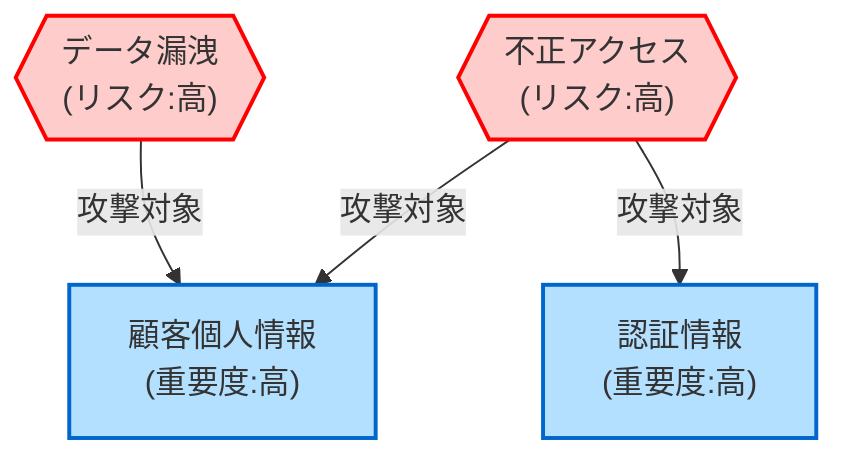

#### 2.3.6 セキュリティ設計書

セキュリティ設計書は、システムのセキュリティ要件と対策を体系的に定義するドキュメントです。AI駆動アプローチでは、セキュリティ要件を構造化された形式で管理し、AIによる脅威分析や対策提案を積極的に活用します。

##### セキュリティ設計書のJSON構造例

```json
{
  "document_info": {
    "id": "SEC-001",
    "title": "セキュリティ設計書",
    "project_name": "顧客管理システム刷新",
    "version": "1.0.0",
    "last_updated": "2025-03-08T10:00:00Z",
    "status": "approved",
    "authors": ["セキュリティ設計チーム"],
    "document_type": "security_design",
    "dependencies": [
      {
        "document_id": "ARCH-001",
        "relationship": "enhances"
      }
    ],
    "confidentiality": "internal_only"
  },
  "document_history": [
    {
      "version": "0.5.0",
      "date": "2025-03-01T09:00:00Z",
      "description": "初期セキュリティ要件定義",
      "authors": ["セキュリティ設計チーム"]
    },
    {
      "version": "1.0.0",
      "date": "2025-03-08T10:00:00Z",
      "description": "正式版リリース",
      "authors": ["セキュリティ設計チーム"]
    }
  ],
  "security_requirements": {
    "compliance_requirements": [
      {
        "id": "CR-001",
        "standard": "GDPR",
        "description": "個人情報の保護と管理に関する要件",
        "applicable_articles": ["Article 5", "Article 25", "Article 32"],
        "priority": "high"
      },
      {
        "id": "CR-002",
        "standard": "PCI-DSS",
        "description": "クレジットカード情報の取り扱いに関する要件",
        "applicable_sections": ["Requirement 3", "Requirement 4", "Requirement 8"],
        "priority": "high"
      }
    ],
    "organizational_requirements": [
      {
        "id": "OR-001",
        "title": "データ分類ポリシー準拠",
        "description": "社内のデータ分類ポリシーに従った情報の扱い",
        "reference_document": "社内セキュリティポリシーv2.3",
        "priority": "medium"
      }
    ]
  },
  "threat_model": {
    "assets": [
      {
        "id": "ASSET-001",
        "name": "顧客個人情報",
        "description": "氏名、住所、連絡先など顧客の個人識別情報",
        "sensitivity": "高",
        "storage_locations": ["顧客データベース", "バックアップストレージ"],
        "data_flow_diagrams": ["DFD-001"]
      },
      {
        "id": "ASSET-002",
        "name": "認証情報",
        "description": "ユーザーID、パスワード、セッション情報",
        "sensitivity": "高",
        "storage_locations": ["認証データベース", "アプリケーションメモリ"],
        "data_flow_diagrams": ["DFD-002"]
      }
    ],
    "threats": [
      {
        "id": "THREAT-001",
        "category": "不正アクセス",
        "description": "認証をバイパスした不正なシステムアクセス",
        "targeted_assets": ["ASSET-001", "ASSET-002"],
        "attack_vectors": ["ブルートフォース攻撃", "セッションハイジャック"],
        "risk_rating": {
          "likelihood": "medium",
          "impact": "high",
          "overall": "high"
        }
      },
      {
        "id": "THREAT-002",
        "category": "データ漏洩",
        "description": "権限のないユーザーへの顧客情報の漏洩",
        "targeted_assets": ["ASSET-001"],
        "attack_vectors": ["SQLインジェクション", "不適切なアクセス制御"],
        "risk_rating": {
          "likelihood": "medium",
          "impact": "high",
          "overall": "high"
        }
      }
    ]
  },
  "security_controls": {
    "authentication_authorization": [
      {
        "id": "SEC-AUTH-001",
        "title": "多要素認証",
        "description": "パスワードに加えて第二の認証要素を要求",
        "implementation": {
          "mechanism": "TOTP (RFC 6238)",
          "requirements": [
            "管理者ユーザーには必須",
            "一般ユーザーにはオプション提供"
          ],
          "technical_notes": "Google AuthenticatorまたはMicrosoft Authenticator互換"
        },
        "addressed_threats": ["THREAT-001"]
      },
      {
        "id": "SEC-AUTH-002",
        "title": "ロールベースアクセス制御",
        "description": "ユーザーロールに基づいた権限管理",
        "implementation": {
          "mechanism": "Spring Security ACL",
          "requirements": [
            "最小権限の原則に基づく設計",
            "動的な権限変更に対応"
          ],
          "technical_notes": "事前定義ロール＋カスタムロール"
        },
        "addressed_threats": ["THREAT-001", "THREAT-002"]
      }
    ],
    "data_protection": [
      {
        "id": "SEC-DATA-001",
        "title": "保存データの暗号化",
        "description": "データベースに保存される機密情報の暗号化",
        "implementation": {
          "mechanism": "AES-256",
          "requirements": [
            "個人情報フィールドは必須暗号化",
            "暗号鍵の適切な管理"
          ],
          "technical_notes": "カラムレベル暗号化とテーブルレベル暗号化の併用"
        },
        "addressed_threats": ["THREAT-002"]
      }
    ],
    "communication_security": [
      {
        "id": "SEC-COMM-001",
        "title": "TLS通信",
        "description": "すべての通信をTLSで暗号化",
        "implementation": {
          "mechanism": "TLS 1.3",
          "requirements": [
            "弱い暗号スイートの無効化",
            "証明書の適切な管理"
          ],
          "technical_notes": "HSTS有効化、証明書自動更新"
        },
        "addressed_threats": ["THREAT-002"]
      }
    ],
    "input_validation": [
      {
        "id": "SEC-INPUT-001",
        "title": "入力検証",
        "description": "すべてのユーザー入力に対するバリデーション",
        "implementation": {
          "mechanism": "サーバーサイドバリデーション + クライアントサイドバリデーション",
          "requirements": [
            "ホワイトリスト方式の採用",
            "特殊文字のエスケープ処理"
          ],
          "technical_notes": "Bean Validation API + カスタムバリデータ"
        },
        "addressed_threats": ["THREAT-002"]
      }
    ],
    "logging_monitoring": [
      {
        "id": "SEC-LOG-001",
        "title": "セキュリティイベントロギング",
        "description": "セキュリティに関連するイベントの記録",
        "implementation": {
          "mechanism": "集中ログ管理システム",
          "requirements": [
            "認証・認可イベントの記録",
            "機密データアクセスの記録",
            "ログの改ざん防止"
          ],
          "technical_notes": "ELKスタック + ログ転送の暗号化"
        },
        "addressed_threats": ["THREAT-001", "THREAT-002"]
      }
    ]
  },
  "secure_development_practices": {
    "code_security": {
      "static_analysis": {
        "tools": ["SonarQube", "FindSecBugs"],
        "frequency": "毎コミット + 日次スケジュール実行",
        "response_requirements": "重大な脆弱性は即時修正"
      },
      "dependencies_management": {
        "tools": ["OWASP Dependency Check", "Snyk"],
        "frequency": "週次スキャン",
        "response_requirements": "Critical/High脆弱性は1週間以内に対応"
      }
    },
    "security_testing": {
      "dynamic_scanning": {
        "tools": ["OWASP ZAP"],
        "frequency": "リリース前 + 月次スキャン",
        "scope": "全APIエンドポイント + Webインターフェース"
      },
      "penetration_testing": {
        "frequency": "年次",
        "scope": "外部専門家によるフルスコープテスト",
        "response_requirements": "Critical/High脆弱性は即時対応"
      }
    }
  },
  "security_architecture": {
    "network_security": {
      "segmentation": {
        "description": "ネットワークの論理的分離",
        "implementation": "VPC + サブネット分離",
        "diagram_reference": "NW-SEC-001"
      },
      "perimeter_protection": {
        "description": "境界防御",
        "implementation": "WAF + DDoS保護",
        "diagram_reference": "NW-SEC-002"
      }
    },
    "defense_in_depth": {
      "description": "多層防御アプローチ",
      "layers": [
        {
          "layer": "外部境界",
          "controls": ["WAF", "DDoS保護", "IPフィルタリング"]
        },
        {
          "layer": "アプリケーション",
          "controls": ["入力バリデーション", "CSRF対策", "XSS対策"]
        },
        {
          "layer": "データ",
          "controls": ["暗号化", "アクセス制御", "監査ロギング"]
        }
      ],
      "diagram_reference": "SEC-ARCH-001"
    }
  },
  "incident_response": {
    "security_incident_definition": {
      "categories": [
        {
          "category": "データ漏洩",
          "definition": "権限のない者への機密情報の露出",
          "examples": ["顧客データの外部流出", "バックアップの紛失"]
        },
        {
          "category": "システム侵害",
          "definition": "システムへの不正アクセスや制御の喪失",
          "examples": ["認証バイパス", "権限昇格"]
        }
      ]
    },
    "response_procedures": {
      "escalation_path": [
        {
          "role": "第一発見者",
          "responsibilities": ["セキュリティ担当者への報告", "基本的な証拠保全"]
        },
        {
          "role": "セキュリティ担当者",
          "responsibilities": ["初期評価", "インシデント宣言", "対応チーム編成"]
        },
        {
          "role": "インシデント対応チーム",
          "responsibilities": ["詳細調査", "封じ込め", "復旧"]
        }
      ],
      "communication_plan": {
        "internal_notification": {
          "recipients": ["CIO", "CISO", "法務部", "広報部"],
          "timing": "インシデント宣言から1時間以内"
        },
        "external_notification": {
          "conditions": "個人情報漏洩の場合は監督官庁への届出が必要",
          "responsible": "CISO + 法務部",
          "timing": "法定期間内（72時間以内）"
        }
      }
    }
  },
  "compliance_validation": {
    "certification_requirements": [
      {
        "standard": "ISO 27001",
        "scope": "情報セキュリティ管理体制",
        "validation_method": "認証審査",
        "schedule": "年次審査"
      }
    ],
    "internal_audits": {
      "frequency": "半年ごと",
      "scope": "セキュリティ管理策の有効性確認",
      "responsible": "内部監査チーム"
    }
  }
}
```

##### AIを活用したセキュリティ要件の抽出と分析

セキュリティ設計の第一歩は、プロジェクトに関連するセキュリティ要件を特定することです。AIを活用して、非機能要件、業界標準、法規制からセキュリティ要件を効率的に抽出できます。

1. **セキュリティ要件抽出プロンプト例**

```
以下のプロジェクト情報と非機能要件から、セキュリティに関連する要件を抽出し、JSON形式で構造化してください。
各要件には以下の情報を含めてください：
- id: 要件ID (形式: SEC-REQ-XXX)
- category: 要件カテゴリ (認証認可/データ保護/通信セキュリティ等)
- title: 要件タイトル
- description: 詳細説明
- source: 出典 (どの文書や規制から抽出されたか)
- priority: 優先度 (high/medium/low)

【プロジェクト情報】
{プロジェクト基本情報}

【非機能要件】
{非機能要件の内容}

【関連法規制】
{プロジェクトに関連する法規制}
```

2. **脅威モデリングプロンプト例**

```
以下のシステム情報をもとに、STRIDE脅威モデリングを実施し、主要な脅威とリスクを識別してください。
結果はJSON形式で出力し、以下の構造に従ってください：

1. 保護すべき資産（情報資産、システム資産）の特定
2. 各資産に対する脅威の特定（STRIDE分類に基づく）
3. 各脅威のリスク評価（発生可能性と影響度）
4. 対応すべき優先順位の決定

【システム情報】
- アーキテクチャ概要：{アーキテクチャ情報}
- データフロー：{データフロー情報}
- ユーザー種別：{ユーザー情報}
- 外部インターフェース：{外部連携情報}
```

3. **AIによるセキュリティ対策推奨プロンプト例**

```
以下の脅威モデリング結果をもとに、各脅威に対する具体的なセキュリティ対策を提案してください。
特に以下の観点を考慮してください：
1. 技術的対策（実装すべきセキュリティ機能）
2. 運用的対策（運用時に実施すべきセキュリティ対策）
3. 開発プロセスでの対策（セキュアコーディング等）

各対策には、実装の複雑さ、コスト、有効性の評価も含めてください。
また、業界標準や最新のベストプラクティスも参照してください。

【脅威モデリング結果】
{脅威モデリングのJSON}
```

##### セキュリティ設計書のJSON形式からの変換例

セキュリティ設計情報をJSON形式で管理することで、一貫性のある文書化と自動検証が可能になります。AIを活用してJSON形式から人間可読な設計書や図表を生成できます。

1. **JSON→脅威モデル図変換プロンプト例**

```
以下のJSON形式の脅威モデル情報から、Mermaid記法を使った脅威モデル図を生成してください。
図では以下の要素を視覚化してください：
- 資産（長方形で表示）
- 脅威（六角形で表示）
- 脅威と資産の関係（矢印で接続）
- リスクレベル（色分け：高=赤、中=黄、低=緑）

【脅威モデル情報】
{脅威モデルのJSON}
```

2. **Mermaid形式の脅威モデル図出力例**



3. **セキュリティアーキテクチャ図生成プロンプト例**

```
以下のセキュリティアーキテクチャ情報をもとに、Mermaid記法を使った多層防御の図を生成してください。
各防御層を明確に区分け、各層に実装されるセキュリティコントロールを視覚的に表現してください。

【セキュリティアーキテクチャ情報】
{セキュリティアーキテクチャのJSON}
```

##### AIによるセキュリティ設計レビューと改善

セキュリティ設計の品質を確保するために、AIを活用した設計レビューと改善提案が有効です。

1. **セキュリティ設計レビュープロンプト例**

```
以下のセキュリティ設計書をレビューし、以下の観点で改善点を指摘してください：

1. 脅威モデルの網羅性（見落とされている脅威はないか）
2. 対策の有効性（各脅威に対して適切な対策が設計されているか）
3. 新しい攻撃手法や脆弱性への対応
4. 法規制・標準への準拠
5. 運用面での実現可能性

具体的な改善提案も含めてください。特に業界のベストプラクティスと比較して不足している点を重点的に指摘してください。

【セキュリティ設計書】
{セキュリティ設計書のJSON}
```

2. **セキュリティ対策のギャップ分析プロンプト例**

```
以下のセキュリティ設計と、OWASP Top 10 (2021)、SANS Top 25、CWEなどの一般的なセキュリティベストプラクティスを比較し、ギャップ分析を行ってください。
特に対応が不足している脆弱性カテゴリや、強化すべき対策領域を特定してください。

分析結果は以下の形式で出力してください：
1. 十分に対応できている領域
2. 部分的に対応できている領域（強化推奨）
3. 対応が不足している領域（優先的に対処すべき）
4. 各領域に対する具体的な改善提案

【セキュリティ設計】
{セキュリティ設計書のJSON}
```

3. **ギャップ分析出力例**

```json
{
  "gap_analysis_summary": "セキュリティ設計書は基本的な要素を網羅していますが、いくつかの重要な強化ポイントが特定されました。",
  "well_covered_areas": [
    {
      "area": "認証・認可",
      "evaluation": "多要素認証とロールベースアクセス制御の実装により、十分にカバーされています。",
      "related_standards": ["OWASP A2:2021 認証の不備", "OWASP A1:2021 アクセス制御の不備"]
    },
    {
      "area": "通信セキュリティ",
      "evaluation": "TLS 1.3の採用とHSTSにより、転送中のデータ保護は十分です。",
      "related_standards": ["OWASP A3:2021 機密データの露出"]
    }
  ],
  "partially_covered_areas": [
    {
      "area": "入力バリデーション",
      "evaluation": "一般的な入力検証は計画されていますが、XSS対策の詳細が不足しています。",
      "related_standards": ["OWASP A3:2021 インジェクション", "CWE-79 XSS"],
      "improvement_suggestions": [
        "コンテキスト依存のXSSエスケープ処理の追加",
        "Content Security Policyの実装"
      ]
    }
  ],
  "inadequately_covered_areas": [
    {
      "area": "サプライチェーンセキュリティ",
      "evaluation": "サードパーティライブラリやコンポーネントのセキュリティ管理が不足しています。",
      "related_standards": ["OWASP A6:2021 脆弱で古いコンポーネントの使用"],
      "improvement_suggestions": [
        "SBOMの作成と管理の追加",
        "継続的な脆弱性スキャンの強化",
        "サードパーティ評価プロセスの確立"
      ]
    },
    {
      "area": "サーバーサイドリクエストフォージェリ対策",
      "evaluation": "SSRF対策が明示的に定義されていません。",
      "related_standards": ["OWASP A9:2021 セキュリティの設計ミス", "CWE-918 SSRF"],
      "improvement_suggestions": [
        "URL検証の強化",
        "内部ネットワークへのアクセス制限",
        "アウトバウンドトラフィックの制限"
      ]
    }
  ],
  "overall_recommendations": [
    "セキュリティ運用面（インシデント対応、脆弱性管理）の詳細化",
    "DevSecOpsパイプラインへのセキュリティテスト自動化の組み込み",
    "セキュリティメトリクスとモニタリングの強化"
  ]
}
```

##### セキュリティ設計の継続的改善

セキュリティ設計は一度作成して終わりではなく、新たな脅威の出現や技術の進化に合わせて継続的に更新すべきものです。AIを活用して効率的に設計を改善できます。

1. **セキュリティ情報の定期的なアップデート**

```
以下のセキュリティ設計書に対して、2025年第1四半期の最新セキュリティ動向や脅威情報を反映した更新提案をしてください。
特に以下の観点で分析してください：

1. 新たに確認された脅威や攻撃手法への対応
2. 最新のセキュリティ標準や推奨事項の反映
3. 新たな法規制要件への対応

【セキュリティ設計書】
{セキュリティ設計書のJSON}

【最近の主なセキュリティインシデント】
{セキュリティインシデント情報}

【最新の法規制動向】
{法規制情報}
```

2. **セキュリティ設計更新のワークフロー例**

以下はClineを活用したセキュリティ設計更新ワークフローの例です：

```bash
# Clineを使ったセキュリティ設計更新ワークフロー

# 1. 最新のセキュリティ設計ファイルをチェックアウト
git checkout main
git pull

# 2. 更新用ブランチ作成
git checkout -b security-design-update-2025Q1

# 3. Clineを使ったセキュリティ標準の最新動向分析
cline "2025年第1四半期におけるOWASP、NIST、ISO 27001などのセキュリティ標準や
ベストプラクティスの主要な変更・更新をまとめてください。
特に顧客管理システムに関連する部分に注目してください。"

# 4. Clineを使った設計書更新
cline "designs/security_design.json ファイルを開き、
次の新しい脅威に対応するためのセキュリティ対策を追加してください：
1. Supply Chain Attack（サプライチェーン攻撃）
2. AI Prompt Injection（AIプロンプトインジェクション）

各脅威に対して、リスク評価と具体的な対策を含めてください。
またドキュメントのバージョン番号も1.0.0から1.1.0に更新してください。"

# 5. 変更の確認
git diff

# 6. コミットとプッシュ
git add designs/security_design.json
git commit -m "Update security design with supply chain and AI prompt injection countermeasures"
git push origin security-design-update-2025Q1

# 7. PRの作成
cline "GitHub PR作成: security-design-update-2025Q1ブランチから
main ブランチへのPRを作成。タイトルは「セキュリティ設計更新：新たな脅威対策追加」、
説明には更新内容の詳細と影響範囲を記載してください。"
```

##### セキュリティ設計のベストプラクティス

AI駆動開発におけるセキュリティ設計のベストプラクティスをいくつか紹介します：

1. **設計の構造化と標準化**
   - セキュリティ設計情報をJSON等の構造化形式で管理
   - 標準的なセキュリティフレームワーク（NIST CSF、ISO 27001など）の参照
   - 一貫した命名規則とカテゴリ分類の使用

2. **脅威モデル駆動設計**
   - システム設計の早期段階から脅威モデリングを実施
   - 具体的なユースケースとアビューズケースの両方を考慮
   - 脅威モデルと対策のトレーサビリティの維持

3. **リスクベースアプローチ**
   - リスク評価に基づく対策の優先順位付け
   - ビジネスインパクト分析との連携
   - 対策のコストと有効性のバランス考慮

4. **AIを活用した継続的セキュリティ評価**
   - 新たな脅威情報に基づく定期的な設計レビュー
   - セキュリティ標準の変更の自動検出と影響分析
   - セキュリティトレンド情報の自動取り込み

5. **セキュリティとユーザビリティのバランス**
   - 過度に複雑なセキュリティ対策の回避
   - ユーザー中心のセキュリティデザイン
   - セキュリティ対策の自動化と透明化

##### AIを活用したセキュリティ適合性検証

セキュリティ設計の適合性を検証するために、AIを活用した自動チェックが有効です。

1. **セキュリティコンプライアンスチェックプロンプト例**

```
以下のセキュリティ設計書が、指定された標準や規制に準拠しているかチェックしてください：

チェック対象の標準/規制：
1. GDPR（特に第25条、第32条）
2. PCI-DSS（要件3、4、8）
3. NIST SP 800-53

各要件に対する適合性を評価し、以下の形式で結果を出力してください：
- 完全準拠：関連する要件と設計の対応関係
- 部分準拠：不足している対策と追加すべき項目
- 未準拠：対応が必要な要件と推奨対策

【セキュリティ設計書】
{セキュリティ設計書のJSON}
```

2. **セキュリティ設計自動評価のWindsurfプロンプト例**

```
# Windsurfでのプロンプト例

セキュリティ設計書 designs/security_design.json を分析し、
OWASP Application Security Verification Standard (ASVS) レベル2の
要件に対する適合性を評価してください。

具体的には以下のステップで実行してください：
1. ASVSの主要な要件カテゴリを特定
2. 各カテゴリの要件に対する設計の対応状況を評価
3. 不足している対策や強化すべき領域を特定
4. 優先的に対応すべき項目のリストを作成

結果はマークダウン形式でレポートにまとめ、designs/security_compliance_report.md
として保存してください。
```

##### AIによるセキュリティ設計の自動生成

まったく新しいプロジェクトや新機能の追加時に、AIを活用して初期セキュリティ設計を自動生成することも可能です。

1. **セキュリティ設計自動生成プロンプト例**

```
次のマイクロサービスの追加に関する基本情報をもとに、セキュリティ設計書の初期ドラフトを生成してください：

【マイクロサービス情報】
名称: 支払い処理サービス
目的: 顧客の決済情報を処理し、外部決済プロバイダと連携する
扱うデータ: クレジットカード情報（トークン化）、取引履歴、顧客ID
外部連携: クレジットカード決済プロバイダAPI、銀行振込API
ユーザー: 一般顧客、カスタマーサポート、システム管理者

セキュリティ設計には以下の要素を含めてください：
1. 関連法規制要件（PCI-DSS等）
2. 主要な脅威モデル
3. セキュリティコントロール
4. セキュリティテスト戦略
5. インシデント対応計画

出力は既存のセキュリティ設計書JSONスキーマに準拠した形式でお願いします。
```

2. **異なるシステム間のセキュリティ設計統合プロンプト例**

```
以下の2つのシステムが統合されることになりました。両システムのセキュリティ設計を分析し、
統合システムに必要なセキュリティ設計を提案してください。

特に以下の点に注目してください：
1. 認証・認可方式の統合アプローチ
2. データ保護要件の統合
3. 新たに発生する脅威とその対策
4. 監査・ログ取得の統合方針

【システムA セキュリティ設計】
{システムA セキュリティ設計のJSON}

【システムB セキュリティ設計】
{システムB セキュリティ設計のJSON}

統合後のセキュリティ設計書をJSON形式で出力してください。
```

セキュリティ設計書は、システムのセキュリティ対策を包括的に定義する重要なドキュメントです。AI駆動アプローチでは、構造化されたデータ形式での管理と、AIを活用した脅威分析・対策立案・レビューのプロセスにより、高品質なセキュリティ設計を効率的に実現できます。また、継続的な改善と検証を通じて、変化する脅威に対応した堅牢なセキュリティ体制を維持することが可能になります。
