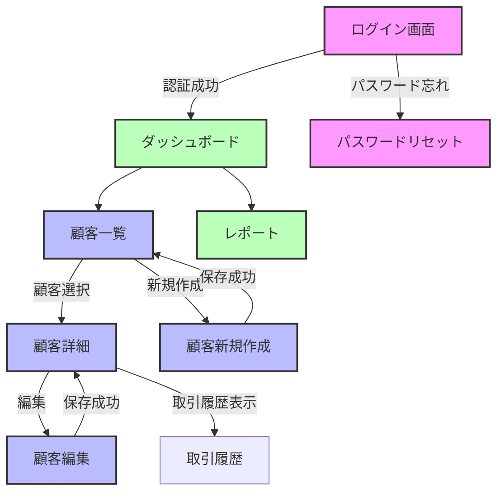

#### 2.3.5 画面遷移図・UI設計書

画面遷移図・UI設計書は、システムのユーザーインターフェースの構造、レイアウト、インタラクションを定義するドキュメントです。AI駆動アプローチでは、UI設計情報もJSON形式で構造化し、一貫性のある設計と自動生成を可能にします。

##### UI/UX設計のJSON構造例

UI設計情報をJSON形式で構造化することで、画面の一貫性確保、コンポーネントの再利用、変更管理が容易になります。以下は画面設計のJSON構造例です：

```json
{
  "document_info": {
    "id": "UI-001",
    "title": "画面遷移図・UI設計書",
    "project_name": "顧客管理システム刷新",
    "version": "1.2.0",
    "last_updated": "2025-03-15T10:00:00Z",
    "status": "approved",
    "authors": ["UI/UX設計チーム"],
    "document_type": "ui_design",
    "dependencies": [
      {
        "document_id": "ARCH-001",
        "relationship": "implements"
      },
      {
        "document_id": "IF-001",
        "relationship": "references"
      }
    ]
  },
  "document_history": [
    {
      "version": "1.0.0",
      "date": "2025-03-01T10:00:00Z",
      "description": "初版作成",
      "authors": ["UI/UX設計チーム"]
    },
    {
      "version": "1.1.0",
      "date": "2025-03-10T09:30:00Z",
      "description": "ユーザーフィードバックに基づく改善",
      "authors": ["UI/UX設計チーム"]
    },
    {
      "version": "1.2.0",
      "date": "2025-03-15T10:00:00Z",
      "description": "顧客検索機能の拡張",
      "authors": ["UI/UX設計チーム"]
    }
  ],
  "design_system": {
    "color_palette": {
      "primary": "#2E7D32",
      "secondary": "#1565C0",
      "accent": "#F57C00",
      "background": "#FFFFFF",
      "surface": "#F5F5F5",
      "error": "#D32F2F",
      "success": "#388E3C",
      "warning": "#FFA000",
      "info": "#0288D1"
    },
    "typography": {
      "font_family": {
        "primary": "Roboto, sans-serif",
        "secondary": "Noto Sans JP, sans-serif",
        "monospace": "Roboto Mono, monospace"
      },
      "styles": {
        "h1": { "font_size": "2.5rem", "font_weight": "700", "line_height": "1.2" },
        "h2": { "font_size": "2rem", "font_weight": "700", "line_height": "1.3" },
        "body": { "font_size": "1rem", "font_weight": "400", "line_height": "1.5" },
        "caption": { "font_size": "0.875rem", "font_weight": "400", "line_height": "1.4" }
      }
    },
    "components": {
      "button": {
        "variants": ["primary", "secondary", "text", "outlined"],
        "sizes": ["small", "medium", "large"],
        "states": ["default", "hover", "active", "disabled", "loading"]
      },
      "input": {
        "variants": ["text", "textarea", "select", "checkbox", "radio", "switch"],
        "states": ["default", "focus", "error", "disabled"]
      },
      "card": {
        "variants": ["elevated", "filled", "outlined"],
        "sections": ["header", "content", "actions"]
      }
    },
    "spacing": {
      "unit": 8,
      "scale": [0, 1, 2, 3, 4, 5, 6, 8, 10, 12]
    },
    "breakpoints": {
      "xs": 0,
      "sm": 600,
      "md": 960,
      "lg": 1280,
      "xl": 1920
    }
  },
  "screens": [
    {
      "id": "SCR-001",
      "name": "ログイン画面",
      "path": "/login",
      "type": "form",
      "access_control": "public",
      "related_requirements": ["FR-007", "NFR-S-001"],
      "layout": {
        "type": "centered",
        "width": "400px",
        "responsive_behavior": "maintain_width_with_min"
      },
      "components": [
        {
          "id": "CMP-001-001",
          "type": "logo",
          "properties": {
            "src": "/assets/images/logo.svg",
            "alt": "顧客管理システム",
            "width": "180px"
          }
        },
        {
          "id": "CMP-001-002",
          "type": "form_container",
          "children": [
            {
              "id": "CMP-001-003",
              "type": "heading",
              "text": "ログイン",
              "level": 1
            },
            {
              "id": "CMP-001-004",
              "type": "input",
              "input_type": "text",
              "label": "ユーザーID",
              "name": "username",
              "placeholder": "ユーザーIDを入力",
              "required": true,
              "validation": {
                "rules": ["required"],
                "messages": {
                  "required": "ユーザーIDを入力してください"
                }
              },
              "accessibility": {
                "aria_label": "ユーザーID入力欄"
              }
            },
            {
              "id": "CMP-001-005",
              "type": "input",
              "input_type": "password",
              "label": "パスワード",
              "name": "password",
              "placeholder": "パスワードを入力",
              "required": true,
              "validation": {
                "rules": ["required", "min:8"],
                "messages": {
                  "required": "パスワードを入力してください",
                  "min": "パスワードは8文字以上で入力してください"
                }
              },
              "accessibility": {
                "aria_label": "パスワード入力欄"
              }
            },
            {
              "id": "CMP-001-006",
              "type": "button",
              "button_type": "submit",
              "variant": "primary",
              "text": "ログイン",
              "size": "large",
              "width": "100%",
              "action": {
                "type": "form_submit",
                "endpoint": "/api/auth/login",
                "method": "POST"
              }
            },
            {
              "id": "CMP-001-007",
              "type": "link",
              "text": "パスワードをお忘れですか？",
              "href": "/password-reset",
              "align": "center",
              "margin_top": 3
            }
          ]
        }
      ],
      "behavior": {
        "on_load": [
          { "action": "focus_element", "element_id": "CMP-001-004" },
          { "action": "check_authentication", "redirect_if_authenticated": "/dashboard" }
        ],
        "form_submission": {
          "validate_client_side": true,
          "show_loading_state": true,
          "success_redirect": "/dashboard",
          "error_handling": {
            "display_mode": "inline",
            "retry_allowed": true
          }
        }
      }
    },
    {
      "id": "SCR-002",
      "name": "顧客一覧画面",
      "path": "/customers",
      "type": "list",
      "access_control": "authenticated",
      "required_permissions": ["customer:read"],
      "related_requirements": ["FR-001", "FR-002"],
      "layout": {
        "type": "sidebar_with_content",
        "responsive_behavior": "stack_on_mobile"
      },
      "components": [
        {
          "id": "CMP-002-001",
          "type": "heading",
          "text": "顧客一覧",
          "level": 1
        },
        {
          "id": "CMP-002-002",
          "type": "search_bar",
          "placeholder": "顧客名、会社名、メールアドレスで検索",
          "action": {
            "type": "filter_list",
            "target": "CMP-002-004"
          }
        },
        {
          "id": "CMP-002-003",
          "type": "filter_panel",
          "filters": [
            {
              "id": "filter-status",
              "label": "ステータス",
              "type": "multi_select",
              "options": [
                { "value": "active", "label": "有効" },
                { "value": "inactive", "label": "無効" },
                { "value": "pending", "label": "承認待ち" }
              ]
            },
            {
              "id": "filter-type",
              "label": "顧客タイプ",
              "type": "radio",
              "options": [
                { "value": "all", "label": "すべて" },
                { "value": "corporate", "label": "法人" },
                { "value": "individual", "label": "個人" }
              ]
            }
          ]
        },
        {
          "id": "CMP-002-004",
          "type": "data_table",
          "data_source": {
            "type": "api",
            "endpoint": "/api/customers",
            "method": "GET"
          },
          "columns": [
            {
              "id": "col-name",
              "header": "顧客名",
              "field": "name",
              "sortable": true,
              "primary": true
            },
            {
              "id": "col-company",
              "header": "会社名",
              "field": "company",
              "sortable": true,
              "hide_on_mobile": false
            },
            {
              "id": "col-email",
              "header": "メールアドレス",
              "field": "email",
              "sortable": true,
              "hide_on_mobile": true
            },
            {
              "id": "col-status",
              "header": "ステータス",
              "field": "status",
              "sortable": true,
              "render_as": "badge",
              "mappings": {
                "active": { "label": "有効", "color": "success" },
                "inactive": { "label": "無効", "color": "error" },
                "pending": { "label": "承認待ち", "color": "warning" }
              }
            },
            {
              "id": "col-actions",
              "header": "操作",
              "type": "action_menu",
              "actions": [
                {
                  "id": "action-view",
                  "label": "詳細",
                  "icon": "eye",
                  "action": {
                    "type": "navigation",
                    "path": "/customers/:id"
                  }
                },
                {
                  "id": "action-edit",
                  "label": "編集",
                  "icon": "edit",
                  "action": {
                    "type": "navigation",
                    "path": "/customers/:id/edit"
                  },
                  "requires_permission": "customer:update"
                },
                {
                  "id": "action-delete",
                  "label": "削除",
                  "icon": "trash",
                  "action": {
                    "type": "modal",
                    "modal_id": "delete-confirmation"
                  },
                  "requires_permission": "customer:delete"
                }
              ]
            }
          ],
          "pagination": {
            "enabled": true,
            "rows_per_page_options": [10, 25, 50, 100],
            "default_rows_per_page": 25
          },
          "sorting": {
            "enabled": true,
            "default_sort": { "field": "name", "direction": "asc" }
          }
        },
        {
          "id": "CMP-002-005",
          "type": "button",
          "variant": "primary",
          "text": "新規顧客登録",
          "icon": "plus",
          "position": "bottom-right",
          "action": {
            "type": "navigation",
            "path": "/customers/new"
          },
          "requires_permission": "customer:create"
        },
        {
          "id": "delete-confirmation",
          "type": "modal",
          "title": "顧客削除の確認",
          "content": "この顧客を削除してもよろしいですか？この操作は取り消せません。",
          "buttons": [
            {
              "id": "cancel-delete",
              "text": "キャンセル",
              "variant": "text",
              "action": { "type": "close_modal" }
            },
            {
              "id": "confirm-delete",
              "text": "削除",
              "variant": "error",
              "action": {
                "type": "api_call",
                "endpoint": "/api/customers/:id",
                "method": "DELETE",
                "on_success": { "type": "refresh_data", "target": "CMP-002-004" },
                "on_error": { "type": "show_error", "message": "削除に失敗しました" }
              }
            }
          ]
        }
      ],
      "behavior": {
        "on_load": [
          { "action": "load_data", "target": "CMP-002-004" }
        ],
        "refresh_intervals": {
          "enabled": false,
          "interval_seconds": 0
        }
      }
    }
  ],
  "navigation": {
    "structure": [
      {
        "id": "NAV-001",
        "title": "ダッシュボード",
        "icon": "dashboard",
        "path": "/dashboard",
        "requires_authentication": true
      },
      {
        "id": "NAV-002",
        "title": "顧客管理",
        "icon": "people",
        "requires_authentication": true,
        "requires_permission": "customer:read",
        "children": [
          {
            "id": "NAV-002-001",
            "title": "顧客一覧",
            "path": "/customers"
          },
          {
            "id": "NAV-002-002",
            "title": "新規顧客登録",
            "path": "/customers/new",
            "requires_permission": "customer:create"
          }
        ]
      }
    ],
    "footer_items": [
      {
        "id": "NAV-F-001",
        "title": "ヘルプ",
        "icon": "help",
        "path": "/help"
      },
      {
        "id": "NAV-F-002",
        "title": "ログアウト",
        "icon": "logout",
        "action": {
          "type": "api_call",
          "endpoint": "/api/auth/logout",
          "method": "POST",
          "on_success": { "type": "navigation", "path": "/login" }
        },
        "requires_authentication": true
      }
    ]
  },
  "screen_transitions": {
    "paths": [
      {
        "from": "SCR-001",
        "to": "SCR-002",
        "condition": "successful_login",
        "transition_type": "redirect"
      },
      {
        "from": "SCR-002",
        "to": "SCR-003",
        "action": "click_customer_detail",
        "transition_type": "navigate"
      }
    ]
  }
}
```

##### AI活用によるUI設計書の生成と検証

UI設計書の作成・検証にAIを活用することで、一貫性の高い設計を効率的に行えます。以下に具体的な方法を示します。

###### 1. AIによる初期UI設計案生成

要件定義からUI設計の初期案を生成するプロンプト例：

```
以下の要件に基づいて、顧客管理システムの「顧客詳細画面」のUI設計をJSON形式で生成してください：

要件:
- 顧客の基本情報（名前、会社名、連絡先等）を表示する
- 顧客に関連する取引履歴を時系列で表示する
- 顧客に関するメモ・コメントを登録・表示できる
- 顧客情報の編集機能へのアクセスを提供する
- レスポンシブデザインに対応すること

以下の設計システムに従ってコンポーネントを選択してください：
{design_system_json}

出力形式は前述のUI設計書JSONスキーマに従ってください。
```

###### 2. AIによるUI設計の整合性検証

設計の一貫性や使いやすさをAIで検証するプロンプト例：

```
以下のUI設計書を分析し、以下の観点で評価・改善提案を行ってください：

1. 一貫性: コンポーネントの使用方法、命名規則、レイアウトパターンの一貫性
2. ユーザビリティ: ユーザーフロー、操作性、フィードバック方法の適切さ
3. アクセシビリティ: スクリーンリーダー対応、キーボード操作対応、コントラスト
4. レスポンシブ対応: 異なる画面サイズでの表示戦略の適切さ
5. デザインシステムの活用: 定義済みデザインシステムの適切な適用
6. 技術的実現性: 実装難易度や技術的制約の考慮

UI設計書:
{ui_design_json}
```

##### 画面遷移図の作成と可視化

画面間の遷移とナビゲーションフローを明確にするために、画面遷移図を作成します。画面遷移図はMermaid記法を使って表現すると、テキストベースで管理しながら視覚的に表現できます。

###### Mermaidを使った画面遷移図の例



###### AI駆動による画面遷移図自動生成

UI設計のJSON構造から画面遷移図を生成するプロンプト例：

```
以下のUI設計JSONから、Mermaid記法を使った画面遷移図を生成してください。
以下の要素を図に含めてください：
1. 全ての画面（ノード）
2. 画面間の遷移条件（エッジラベル）
3. 機能グループごとの色分け
4. 認証・権限による制約の表示

UI設計JSON:
{ui_design_json}
```

##### モックアップ・プロトタイプとの連携

UIの設計と実際の見た目・操作感のギャップを埋めるため、モックアップツールとの連携が重要です。

###### JSON設計からのモックアップ自動生成

設計JSONからFigma/Sketch等のモックアップを生成するプロンプト例：

```
以下のUI設計JSONをもとに、Figma用のコンポーネント構成と画面レイアウトの詳細な説明を生成してください。
各コンポーネントの配置、サイズ、スタイル、インタラクションを具体的に記述し、
Figmaで実装する際の手順を含めてください。

UI設計JSON:
{ui_design_json}
```

###### プロトタイプからのフィードバック収集とデザイン更新

プロトタイプテストの結果をAIで分析し、設計にフィードバックする例：

```
ユーザーテスト結果をもとに、UI設計の改善点を特定してください。

ユーザーテスト要約:
{user_test_summary}

現在のUI設計JSON:
{ui_design_json}

具体的な改善提案をJSON形式で出力し、変更理由も説明してください。
```

##### レスポンシブ設計と複数デバイス対応

マルチデバイス対応は現代のUI設計で必須です。レスポンシブな設計を構造化するためのアプローチを示します。

###### レスポンシブ設計のJSONによる表現

```json
"responsive_rules": {
  "SCR-002": {
    "breakpoints": {
      "xs": {
        "layout": "stacked",
        "hidden_components": ["CMP-002-003"],
        "column_adjustments": [
          { "column_id": "col-email", "visibility": "hidden" },
          { "column_id": "col-phone", "visibility": "hidden" }
        ]
      },
      "sm": {
        "layout": "stacked",
        "hidden_components": [],
        "column_adjustments": [
          { "column_id": "col-email", "visibility": "visible" },
          { "column_id": "col-phone", "visibility": "hidden" }
        ]
      },
      "md": {
        "layout": "sidebar_with_content",
        "hidden_components": [],
        "column_adjustments": [
          { "column_id": "col-email", "visibility": "visible" },
          { "column_id": "col-phone", "visibility": "visible" }
        ]
      }
    }
  }
}
```

###### AIによるレスポンシブ設計チェック

各デバイスでのUIの整合性をチェックするプロンプト例：

```
以下のUI設計に対して、モバイル・タブレット・デスクトップ各デバイスでの表示を分析し、
情報の優先度と画面サイズに基づいた表示方法が適切かレビューしてください。
特に以下の点を確認してください：
1. 小画面時の情報優先順位は適切か
2. タッチインターフェースでの操作性
3. 各ブレイクポイントでのレイアウト変更の妥当性
4. 一貫したユーザー体験の維持

UI設計JSON:
{ui_design_json}
```

##### アクセシビリティの確保

誰もが利用できるシステム設計のためにアクセシビリティを組み込みます。

###### アクセシビリティ要件のJSON表現

```json
"accessibility": {
  "components": {
    "CMP-001-004": {
      "aria_label": "ユーザーID入力欄",
      "aria_required": true,
      "aria_describedby": "username-helper-text",
      "error_announcement": "ユーザーIDを入力してください"
    }
  },
  "color_contrast": {
    "minimum_ratio": 4.5,
    "text_elements": {
      "normal_text": 4.5,
      "large_text": 3
    }
  },
  "keyboard_navigation": {
    "tab_order": [
      "CMP-001-004",
      "CMP-001-005",
      "CMP-001-006",
      "CMP-001-007"
    ],
    "focus_visible": true,
    "shortcuts": {
      "alt+1": "ダッシュボードに移動",
      "alt+2": "顧客一覧に移動"
    }
  }
}
```

###### AIによるアクセシビリティチェック

アクセシビリティ基準に対する検証プロンプト例：

```
以下のUI設計に対して、WCAG 2.1 AA基準に照らしたアクセシビリティチェックを行い、
問題点と改善案を提示してください。以下の観点を特に確認してください：
1. スクリーンリーダー対応（aria属性、意味的なHTML構造）
2. キーボードナビゲーション
3. コントラスト比
4. フォームのエラーハンドリングとフィードバック
5. 代替テキスト

UI設計JSON:
{ui_design_json}
```

##### UI設計書作成のベストプラクティス

###### 1. 設計システムの先行定義

- 色、タイポグラフィ、コンポーネント、スペーシングなどのデザイントークンを先に定義
- これらを常にJSON形式で管理し、設計の一貫性を確保
- Figma等のデザインツールと同期する仕組みを作る

###### 2. コンポーネントの再利用性重視

- 共通UIコンポーネントはライブラリ化して一元管理
- 各画面ではコンポーネントIDを参照する形で構成
- 変更はコンポーネント定義から行い、使用箇所に一括反映

###### 3. UIとAPIの整合性確保

- UIに表示するデータとAPIレスポンスの構造を一致させる
- フォーム送信データとAPIリクエスト形式の一貫性を保つ
- 変更があった場合の同期メカニズムを確立

###### 4. アジャイル対応の段階的詳細化

- 初期のUI設計はコア機能と主要画面に集中
- 反復開発に合わせて詳細化していく
- 設計変更履歴を明示的に残し、トレーサビリティを確保

##### AIを活用したUI設計ワークフロー例

1. **要件の構造化**
   - 要件定義ドキュメントからUI関連要件を抽出
   - ユーザーストーリーから必要な画面とインタラクションを特定

2. **デザインシステム定義**
   - AIにブランドガイドラインから基本デザイントークンを生成させる
   - カラーパレット、タイポグラフィ、コンポーネントライブラリを定義

3. **画面設計の生成**
   - ワイヤーフレームをAIに生成させ、基本レイアウトを決定
   - 各画面のコンポーネント構成をJSONで詳細化

4. **画面遷移設計**
   - ユーザーフローをもとに画面遷移図を生成
   - 条件分岐や権限による制約を追加

5. **レスポンシブ設計**
   - 各画面のブレイクポイント別設定を定義
   - 異なるデバイスでの表示方法をAIに提案させる

6. **アクセシビリティ強化**
   - アクセシビリティ要件をJSONに追加
   - AIにアクセシビリティ検証を実施させる

7. **プロトタイプ連携**
   - 設計JSONからデザインツール向け仕様を生成
   - プロトタイプテスト結果を設計にフィードバック

8. **ドキュメント自動生成**
   - 最終的なUI設計書をAIに文書化させる
   - 開発チーム向けの実装ガイドを生成

##### AIツールを活用したUI設計の実践例

###### Cursorでの画面設計

Cursorを使用して、JSONベースのUI設計から実装コードを生成する手順：

1. UI設計JSONをローカルプロジェクトに保存
2. Cursorチャットで以下のように指示：

```
以下のUI設計JSONに基づいて、React+Tailwind CSSを使用した顧客詳細画面のコンポーネントを実装してください。
マテリアルUIの概念に従ったデザインで、レスポンシブ対応も含めてください。

UI設計JSON:
designs/ui/customer_detail.json
```

###### Windsurfでのデザイン一貫性検証

Windsurfを活用して、プロジェクト全体のUIコンポーネント使用状況を分析：

```
プロジェクト全体のReactコンポーネントを分析し、以下の点についてレポートしてください：
1. UIコンポーネントの使用頻度と一貫性
2. 定義されたデザインシステムからの逸脱点
3. 未使用または重複したコンポーネント
4. アクセシビリティ対応が不十分なコンポーネント

特に以下のファイルを参照してください：
designs/ui/design_system.json
src/components/**/*.tsx
```

###### Clineによる画面遷移の最適化

Clineを使ってユーザージャーニーを分析し、画面遷移を最適化：

```bash
cline "既存のアプリケーションのログからユーザー行動パターンを分析し、
最も頻繁に使用される画面遷移パスを特定してください。
現在の画面遷移設計（designs/ui/screen_transitions.json）と比較し、
ユーザー体験を向上させるための最適化提案を行ってください。
特にクリック数削減とタスク完了時間短縮に注目し、
具体的な画面遷移の改善案をJSONで出力してください。"
```

##### UI設計と他の設計ドキュメントとの連携

UI設計は他の設計ドキュメントと密接に関連しており、整合性を保つことが重要です。

###### APIインターフェースとの整合性

UI設計とAPI設計の整合性を確認するプロンプト例：

```
以下のUI設計とAPI仕様を比較し、整合性の問題を特定してください：

UI設計JSON:
{ui_design_json}

API仕様JSON:
{api_specification_json}

特に以下の観点で検証してください：
1. UIフォームで送信するデータ構造とAPIリクエスト形式の一致
2. APIレスポンスデータがUI表示要件を満たしているか
3. エラーハンドリングの整合性
4. ページネーション、ソート、フィルタリングの実装一貫性
```

###### セキュリティ設計との連携

UI設計とセキュリティ要件の整合性確認：

```
以下のUI設計に対して、セキュリティ設計要件が適切に実装されているか検証してください：

UI設計JSON:
{ui_design_json}

セキュリティ設計要件:
{security_requirements_json}

特に以下の観点で検証してください：
1. 認証・認可の適切な実装（権限によるUI要素の表示/非表示）
2. 機密情報の扱い
3. 入力検証とXSS対策
4. CSRFトークンの実装
```

###### データモデルとの整合性

UI設計とデータモデルの整合性確認：

```
以下のUI設計とデータモデルを比較し、データ表示・編集の整合性を検証してください：

UI設計JSON:
{ui_design_json}

データモデルJSON:
{data_model_json}

特に以下の観点で検証してください：
1. UI表示項目とデータモデルのフィールド対応
2. バリデーションルールの一貫性
3. 外部キー関係の適切な表現
4. 列挙型値の表示方法
```

##### UI変更管理とバージョニング

UI設計の変更履歴を管理し、トレーサビリティを確保します。

###### 変更管理のJSON表現

```json
"version_history": [
  {
    "version": "1.0.0",
    "date": "2025-03-01T10:00:00Z",
    "author": "UI設計チーム",
    "changes": [
      {
        "type": "add",
        "component_id": "SCR-001",
        "description": "ログイン画面の初期設計"
      }
    ]
  },
  {
    "version": "1.1.0",
    "date": "2025-03-08T14:30:00Z",
    "author": "UI設計チーム",
    "changes": [
      {
        "type": "modify",
        "component_id": "SCR-001",
        "description": "パスワードリセットリンクの追加",
        "related_requirements": ["FR-008"]
      },
      {
        "type": "add",
        "component_id": "SCR-002",
        "description": "顧客一覧画面の追加",
        "related_requirements": ["FR-001", "FR-002"]
      }
    ]
  },
  {
    "version": "1.2.0",
    "date": "2025-03-15T09:15:00Z",
    "author": "UI設計チーム",
    "changes": [
      {
        "type": "modify",
        "component_id": "SCR-002",
        "description": "フィルターパネルの機能拡張",
        "related_requirements": ["FR-003"],
        "reasons": ["ユーザーテストフィードバックに基づく改善"]
      }
    ]
  }
]
```

###### AIによる変更影響分析

UI設計変更の影響範囲を分析するプロンプト例：

```
以下のUI設計変更を検討しています。この変更が他のコンポーネントや画面に与える影響を分析してください：

変更内容：顧客一覧画面のデータテーブルに「最終接触日」カラムを追加し、ソート可能にする

現在のUI設計JSON:
{ui_design_json}

特に以下の観点で影響範囲を分析してください：
1. 変更が必要な関連コンポーネント
2. APIやデータモデルへの影響
3. レスポンシブ設計への影響
4. 画面遷移やユーザーフローへの影響
5. 変更の技術的難易度

具体的な変更案と実装方針も提案してください。
```

### まとめ

画面遷移図・UI設計書はシステムのユーザー体験を形作る重要なドキュメントです。AI駆動設計アプローチでは：

1. **設計情報の構造化**：UI設計をJSON形式で構造化し、機械的処理を可能に
2. **デザインシステムの一元管理**：コンポーネントを再利用可能な形で定義
3. **AIによる設計支援**：初期設計生成、一貫性検証、最適化提案
4. **画面遷移の明確化**：ユーザーフローを視覚的に表現
5. **レスポンシブ設計の体系化**：デバイス適応を構造的に定義
6. **アクセシビリティの組み込み**：標準対応をJSONに統合
7. **他の設計との整合性確保**：API、データモデル、セキュリティ設計との一貫性

すべての設計ドキュメントと同様に、画面遷移図・UI設計書も生きたドキュメントとして扱い、実装・テスト結果に基づいて継続的に改善していくことが重要です。
